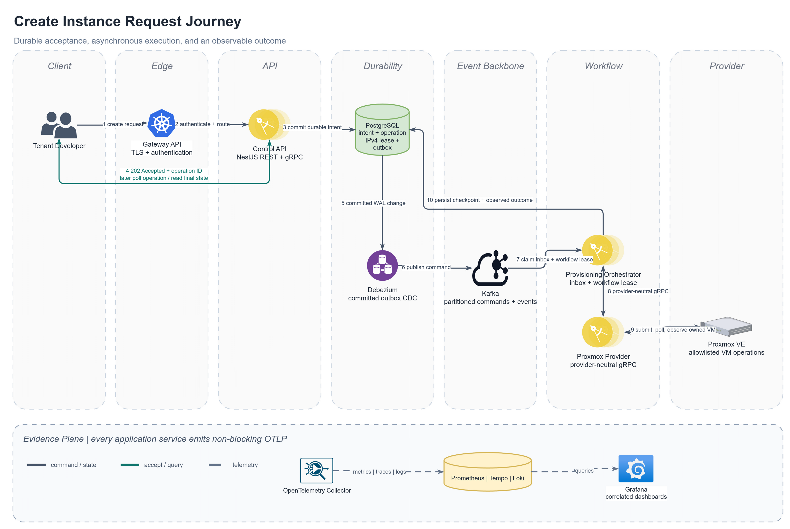
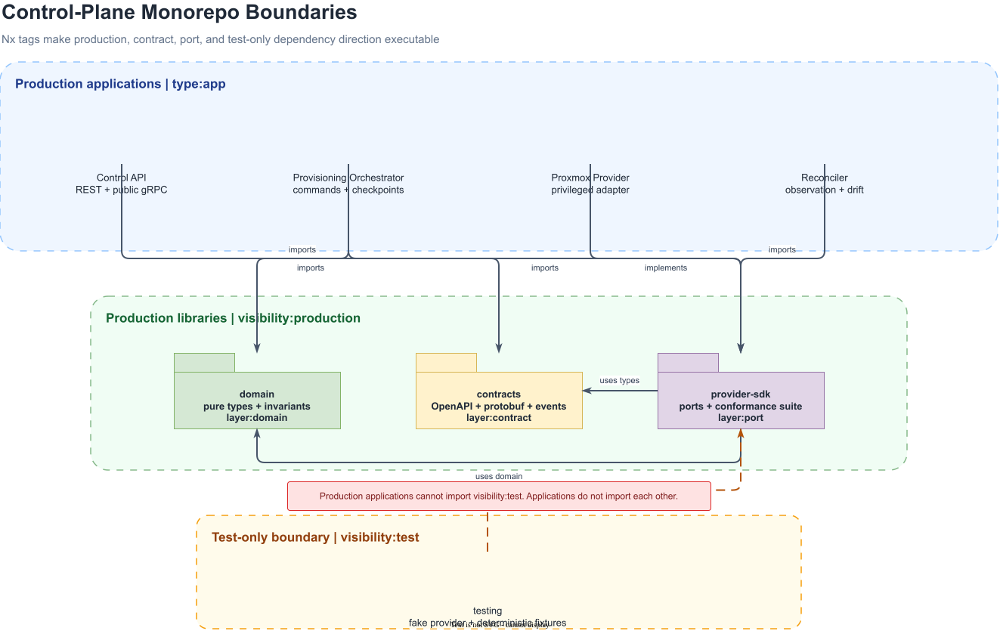
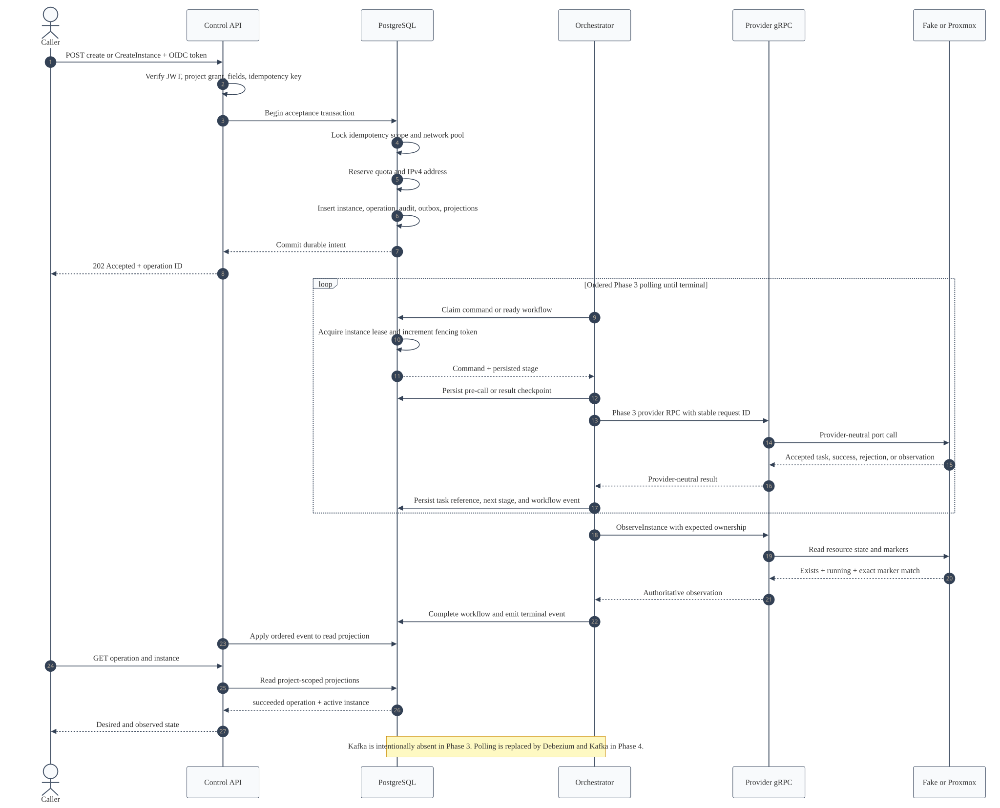
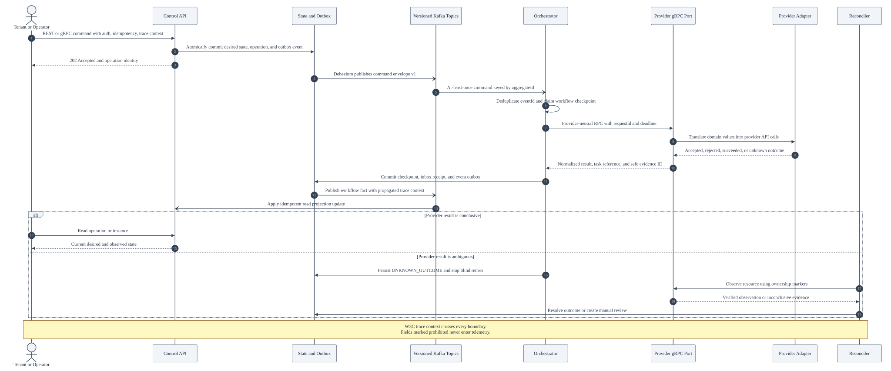

# Private Cloud Control Plane

A provider-neutral control plane for asynchronous virtual-machine lifecycle management. The system accepts REST commands, coordinates provider work over an internal gRPC boundary, persists desired state, publishes work through a transactional outbox, reconciles provider state, and exposes correlated traces, metrics, and logs.

The primary runtime target is an existing Kubernetes cluster. Proxmox is the first provider adapter, not a domain dependency. A bounded AWS serverless path will implement the same command and event contracts with DynamoDB, Lambda, and SQS.

## Request Journey



A create request returns `202 Accepted` only after the control plane commits durable intent and its outbox record. Debezium then publishes the command to Kafka for leased, idempotent orchestration; provider results are persisted as observed state, while OpenTelemetry carries non-blocking metrics, traces, and logs to the evidence plane.

[Open the editable Draw.io source](docs/diagrams/src/create-instance-request-journey.drawio).

## Monorepo

The application lifecycle is one pnpm/Nx workspace. Nx tags enforce dependency direction between production applications, provider-neutral contracts, ports, and test-only adapters.



[Open the editable monorepo diagram](docs/diagrams/src/monorepo-boundaries.drawio).

| Project                     | Boundary                                                  | Runtime status     |
| --------------------------- | --------------------------------------------------------- | ------------------ |
| `control-api`               | Synchronous command acceptance and project queries        | REST + gRPC active |
| `provisioning-orchestrator` | Asynchronous workflow coordination                        | Phase 3 active     |
| `proxmox-provider`          | Privileged provider-neutral gRPC adapter                  | Fake/Proxmox active |
| `reconciler`                | Scheduled observation and drift classification            | Process shell      |
| `domain`                    | Framework-independent types and invariants                | Create slice active |
| `contracts`                 | REST, gRPC, and event contract source and generated types | Contracts defined  |
| `provider-sdk`              | Provider-neutral lifecycle port and transport semantics   | Port defined       |
| `provider-adapters`         | Deterministic fake and allowlisted Proxmox implementations | Create slice active |
| `testing`                   | Deterministic provider adapter and conformance fixtures   | Test implementation |

## Phase 3 Vertical Slice



The implemented pre-Kafka slice accepts REST or gRPC create intent, commits it with an outbox row, executes leased and fenced workflow checkpoints through the internal provider gRPC boundary, proves final ownership through observation, and applies ordered read projections.



[Phase 3 implementation, recovery semantics, configuration, and evidence](docs/architecture/phase-3-vertical-slice.md)

## Contract Surface



The source specifications are authoritative and generate the TypeScript used by services. Summary counts are checked in CI; the linked documents contain the exhaustive endpoint, method, message, error, and field tables.

| Contract | Version | Surface | Authority | Exhaustive table |
| --- | --- | ---: | --- | --- |
| REST | OpenAPI 3.1 / API v1 | 39 operations | `packages/contracts/openapi` | [REST API](docs/contracts/rest-api.md) |
| Public gRPC | protobuf package `v1` | 37 RPCs | `control_plane.proto` | [gRPC API](docs/contracts/grpc-api.md) |
| Provider gRPC | protobuf package `v1` | 17 RPCs | `provider.proto` | [gRPC API](docs/contracts/grpc-api.md) |
| Kafka | AsyncAPI 3.1 / topics `v1` | 5 topics, 18 messages | `packages/contracts/asyncapi` | [Kafka events](docs/contracts/events.md) |
| Field catalog | Generated | 870 declared field rows | All contract sources | [Fields](docs/contracts/fields.md) |
| Errors | RFC 9457 and canonical gRPC status | Stable automation codes | OpenAPI and RPC policy | [Errors](docs/contracts/errors.md) |

REST mutation bodies are limited to 65,536 bytes and Kafka event payloads to 262,144 bytes. Mutation identities are mandatory. Contract fields explicitly identify values prohibited from telemetry.

## Provider Conformance



The provider SDK contains no vendor type. Its deterministic test implementation covers accepted task polling, classified failure, injected latency, duplicate delivery, request-identity conflicts, timeouts before and after provider application, and applied unknown outcomes resolved through observation.

[Contract and provider boundary details](docs/architecture/contracts-and-provider-port.md)

## Quality Gates



```bash
pnpm run contracts:generate
pnpm run contracts:validate
pnpm run contracts:docs
pnpm run docs:validate
pnpm run format:check
pnpm run lint
pnpm run typecheck
pnpm run test
pnpm run build
pnpm audit --prod --audit-level high
```

CI also builds each service as a pinned, non-root runtime image and rejects high or critical findings from Trivy. [Quality gate details](docs/architecture/quality-gates.md)

Local workspace checks use the pinned Node and pnpm versions:

| Tool       | Version  | Purpose                              |
| ---------- | -------- | ------------------------------------ |
| Node.js    | 24.18.0  | Build and service runtime            |
| pnpm       | 11.3.0   | Reproducible workspace installation  |
| Nx         | 23.1.1   | Project graph and task orchestration |
| NestJS     | 11.2.1   | Service framework                    |
| TypeScript | 5.9.3    | Strict compilation                   |
| ESLint     | 9.39.5   | Typed static analysis                |
| Vitest     | 4.1.11   | Unit and contract tests              |

TypeScript and ESLint are pinned to the supported Nx and `typescript-eslint` peer matrix. Container builds pin the same Node.js and pnpm releases used by the workspace.

```bash
pnpm install --frozen-lockfile
pnpm run contracts:validate
pnpm run docs:validate
pnpm format:check
pnpm lint
pnpm typecheck
pnpm build
```

## Repository Boundary

This repository owns application source, shared contracts, database migrations, automated tests, and product and architecture documentation. Kubernetes runtime state, observability deployments, and AWS infrastructure belong in a separate GitOps repository. Cluster bootstrap and foundational services remain in the existing foundation repository.

The repository boundaries and promotion contract are defined in [Repository Boundaries](docs/architecture/repository-boundaries.md).

## Documentation Map

### Product and Requirements

- [Scope Baseline](docs/product/scope-baseline.md): frozen MVP boundary, capability priorities, and excluded work
- [Capability Assessment](docs/product/capability-assessment.md): reusable behavior and provider integration assessment
- [Product Requirements Document](docs/product/prd.md): problem, personas, use cases, success measures, non-goals, and MVP definition
- [Software Requirements Specification](docs/product/srs.md): numbered functional, non-functional, and architecture requirements
- [Requirements Traceability](docs/product/requirements-traceability.md): requirement-to-use-case, architecture, evidence, and verification mapping

### Reading the Code

Start here if you are new to the codebase. It is not a conventional `Controller → Service → Repository` application: commands are accepted as durable intent, executed asynchronously by a leased and fenced workflow, and read back through projections. These three documents supply the vocabulary and the route through the source.

- [Pattern Glossary](docs/architecture/glossary.md): transactional outbox, inbox, lease and fencing token, persisted saga, read projection, advisory lock, and ports and adapters, each mapped to the code that implements it
- [Code Reading Guide](docs/architecture/code-reading-guide.md): one create request traced end to end through every file it touches, plus a suggested reading order
- [Comment Standard](docs/architecture/comment-standard.md): how this code is documented and how to extend it; partly enforced by `eslint-plugin-jsdoc`

### Architecture and Safety

- [Safety Invariants](docs/architecture/safety-invariants.md): mandatory ownership, delivery, provider, resource, and telemetry rules
- [Lab Boundary](docs/architecture/lab-boundary.md): exact live-provider scope and activation gate
- [C4 Model](docs/architecture/c4-model.md): system context and container views
- [Create-Instance Sequence](docs/architecture/create-instance-sequence.md): acceptance, outbox, workflow, provider, and projection path
- [Proxmox Create Call Map](docs/architecture/proxmox-create-call-map.md): allowlisted Phase 3 endpoints, task semantics, and rejected behaviors
- [Failure Sequences](docs/architecture/failure-sequences.md): broker outage, provider timeout, duplicate delivery, and compensation behavior
- [State Machines](docs/architecture/state-machines.md): instance, desired power, observed provider, and operation lifecycles
- [Data Ownership Map](docs/architecture/data-ownership.md): authoritative writers, schemas, topics, transactions, and AWS ownership
- [Phase 3 Persistence](docs/architecture/phase-3-persistence.md): implemented schemas, records, locks, and acceptance transaction
- [Phase 3 Vertical Slice](docs/architecture/phase-3-vertical-slice.md): runtime components, workflow stages, recovery semantics, provider selection, and evidence
- [Phase 3 API Implementation](docs/contracts/phase-3-api.md): active REST/gRPC subset, authentication, fields, and error behavior
- [Contracts and Provider Port](docs/architecture/contracts-and-provider-port.md): wire authorities, compatibility rules, provider outcomes, and conformance behavior
- [Quality Gates](docs/architecture/quality-gates.md): CI stages, failure policy, dependency audit, and container scanning

### Security and Decisions

- [Trust Boundaries](docs/security/trust-boundaries.md): identities, crossings, required controls, and network intent
- [Threat Model](docs/security/threat-model.md): assets, STRIDE threats, abuse cases, controls, and residual risk
- [Architecture Decision Records](docs/adr/README.md): accepted decisions that constrain implementation

## Current State

The Phase 3 synchronous vertical slice is complete in code. The control API authenticates OIDC callers and accepts create intent idempotently over REST and gRPC; PostgreSQL atomically commits desired state, operation, IPv4 reservation, audit, and outbox records; the orchestrator executes leased and fenced checkpoints through the provider gRPC service; and ordered projections expose terminal operation and instance state. The fake path is verified end to end. The Proxmox path is implemented behind strict allowlists and fixture-tested, but no live provider mutation has been run.
