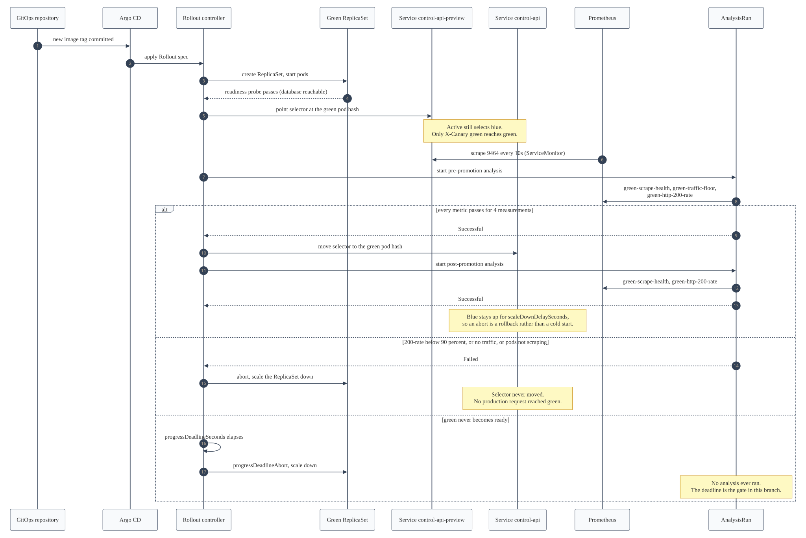

# Private Cloud Control Plane

A provider-neutral control plane for asynchronous virtual-machine lifecycle management. The system accepts REST commands, coordinates provider work over an internal gRPC boundary, persists desired state, publishes work through a transactional outbox, reconciles provider state, and exposes correlated traces and metrics. Centralized logs are reserved for the Kubernetes deployment phase.

The primary runtime target is an existing Kubernetes cluster. Proxmox is the first provider adapter, not a domain dependency. A bounded AWS serverless path will implement the same command and event contracts with DynamoDB, Lambda, and SQS.

## Request Journey


A create request returns `202 Accepted` only after the control plane commits durable intent and its outbox record. Debezium then publishes the command to Kafka for leased, idempotent orchestration; provider results are persisted as observed state, while OpenTelemetry carries non-blocking traces and metrics to the evidence plane.

[Open the editable Draw.io source](docs/diagrams/src/create-instance-request-journey.drawio).

## Monorepo

The application lifecycle is one pnpm/Nx workspace. Nx tags enforce dependency direction between production applications, provider-neutral contracts, ports, and test-only adapters.


[Open the monorepo Mermaid source](docs/diagrams/mermaid/phase-4-monorepo-boundaries.mmd).

| Project                     | Boundary                                                  | Runtime status     |
| --------------------------- | --------------------------------------------------------- | ------------------ |
| `control-api`               | Synchronous command acceptance and project queries        | REST + gRPC active |
| `provisioning-orchestrator` | Asynchronous workflow coordination                        | Phase 4 active     |
| `proxmox-provider`          | Privileged provider-neutral gRPC adapter                  | Fake/Proxmox active |
| `reconciler`                | Scheduled observation and drift classification            | Process shell      |
| `domain`                    | Framework-independent types and invariants                | Create slice active |
| `contracts`                 | REST, gRPC, and event contract source and generated types | Contracts defined  |
| `provider-sdk`              | Provider-neutral lifecycle port and transport semantics   | Port defined       |
| `provider-adapters`         | Deterministic fake and allowlisted Proxmox implementations | Create slice active |
| `postgres-adapter`          | Owner transactions, inbox/outbox, workflow, and projections | Phase 4 active     |
| `messaging`                 | Kafka envelope validation and explicit-offset consumers     | Phase 4 active     |
| `observability`             | OpenTelemetry SDK, propagation, traces, and metrics          | Phase 4 active     |
| `testing`                   | Deterministic provider adapter and conformance fixtures   | Test implementation |

## Phase 4 Event Pipeline


The create-instance path now crosses a PostgreSQL transactional outbox, Debezium CDC, versioned
Kafka commands, an inbox-deduplicated workflow, provider gRPC, and Kafka-backed read projections.
Offsets advance only after durable consumer transactions. Bounded permanent failures enter a
governed DLQ and replay path; infrastructure failures remain uncommitted for recovery.
Control API and Orchestrator state changes also publish append-only `audit.recorded` facts from their
own transactions, partitioned by project for the future audit archive.
Authorized replay writes the restored generation to the Orchestrator outbox and waits for its Kafka
delivery before reopening work, so every command receipt retains genuine broker coordinates.

Administrators read that history through a restricted surface available on both transports: audit
facts, dead-letter evidence, and one operation enriched with correlation, causation, trace, retry,
checkpoint, dead-letter, and provider-task detail. The operation route is deliberately not scoped by
project membership, because the administrator who authorizes a replay is routinely not a member of
the affected project. Every list is keyset-paginated with an opaque cursor; a cursor this service
did not issue is rejected rather than silently restarting the caller at page one.


OpenTelemetry context is preserved through HTTP/gRPC, PostgreSQL, Debezium, Kafka, workflow
checkpoints, and provider calls. Applications and Java agents push OTLP telemetry to the Collector;
the Collector gathers PostgreSQL and self-metrics, exports traces to Tempo, and presents the only
endpoint Prometheus scrapes. Grafana queries those backends without entering the correctness path.

Build and start the complete local Phase 4 environment with:

```bash
pnpm run verify:phase4-runtime -- --reset
```

The gate builds the production images, starts the complete Compose topology, executes happy-path and
failure-recovery drills, scans exported telemetry, captures Grafana and Tempo screenshots, and leaves
the persistent stack healthy. The Proxmox adapter is exercised against a local TLS
Proxmox-compatible simulator; no hypervisor is contacted or mutated.

The Grafana event-pipeline dashboard is served at
`http://127.0.0.1:3101/d/private-cloud-phase4-event-pipeline/private-cloud-event-pipeline`.
The API is on `http://127.0.0.1:3100`; Prometheus is on `http://127.0.0.1:9090`; Tempo is on
`http://127.0.0.1:3200`; and Kafka Connect is on `http://127.0.0.1:8083`.
Application process configuration and failure procedures are documented in the
[Phase 4 architecture](docs/architecture/phase-4-messaging-and-observability.md) and
[recovery runbook](docs/runbooks/phase-4-failure-recovery.md). Instrument definitions and
cardinality rules are in the [Phase 4 metric catalog](docs/observability/phase-4-metric-catalog.md).

## Phase 6 Kubernetes Deployment



Everything the control plane runs is declared in [`deploy/kubernetes`](deploy/kubernetes) and
reconciled continuously by Argo CD. The four services are deployed as Argo Rollouts `Rollout`
objects — not `Deployment` — using a blue-green strategy: the new version starts beside the old
one, a header-matched `HTTPRoute` sends `X-Canary: green` requests to it, and an automated analysis
measures the result before the active `Service` is allowed to move.



The gate is three Prometheus queries: an HTTP 200 rate of at least 90% on the green environment, a
traffic floor so that silence cannot be mistaken for health, and a scrape-health check so that a
blind gate cannot pass. Below any of them the rollout aborts, the active `Service` never moves, and
no production request reaches the new version. Argo CD self-heals the other direction, reverting
anything changed in the cluster by hand.

```bash
pnpm run k8s:build-images        # build every image into minikube's own Docker daemon
pnpm run k8s:bootstrap           # install on a fresh cluster (idempotent)
pnpm run k8s:publish             # publish manifest edits, then refresh and sync
pnpm run k8s:render-check        # render, validate schemas, apply deployment policies
pnpm run verify:phase6-runtime   # prove it at runtime, including promotion drills
pnpm run postman:run             # exercise the whole API through the Gateway
```

Step by step, with teardown, image builds, and how to get a bearer token, in the
[Phase 6 Operations Manual](docs/operations/phase-6-operations-manual.md).

CloudNativePG, Strimzi, and KEDA are installed declaratively as Argo CD applications; PostgreSQL and
Kafka credentials are generated in-cluster by those operators and never enter the repository. The
architecture, the substitutions this cluster forced, and the Longhorn/Kafka replication tradeoff are
in [Phase 6 GitOps Deployment](docs/architecture/phase-6-gitops-deployment.md); failure procedures
are in [Phase 6 Deployment Runbook](docs/runbooks/phase-6-deployment.md); the scrape path that makes
the gate possible is in
[Phase 6 Deployment Metric Catalog](docs/observability/phase-6-deployment-metrics.md).

An importable Postman collection exercises the whole API against the deployed cluster — 63 requests
covering all 39 declared REST operations, including the refusals the safety rules depend on. It is
runnable headlessly with `pnpm run postman:run`, and it is what found the eight lifecycle defects
recorded in `phase-6-completion-checkpoints.md`. See
[Phase 6 Postman Collection](docs/operations/phase-6-postman-collection.md) and
[Phase 6 API Examples](docs/operations/phase-6-api-examples.md).

## Phase 3 Vertical Slice


The implemented pre-Kafka slice accepts REST or gRPC create intent, commits it with an outbox row, executes leased and fenced workflow checkpoints through the internal provider gRPC boundary, proves final ownership through observation, and applies ordered read projections.


[Phase 3 implementation, recovery semantics, configuration, and evidence](docs/architecture/phase-3-vertical-slice.md)

## Contract Surface


The source specifications are authoritative and generate the TypeScript used by services. Summary counts are checked in CI; the linked documents contain the exhaustive endpoint, method, message, error, and field tables.

| Contract | Version | Surface | Authority | Exhaustive table |
| --- | --- | ---: | --- | --- |
| REST | OpenAPI 3.1 / API v1 | 39 operations | `packages/contracts/openapi` | [REST API](docs/contracts/rest-api.md) |
| Public gRPC | protobuf package `v1` | 37 RPCs | `control_plane.proto` | [gRPC API](docs/contracts/grpc-api.md) |
| Provider gRPC | protobuf package `v1` | 17 RPCs | `provider.proto` | [gRPC API](docs/contracts/grpc-api.md) |
| Kafka | AsyncAPI 3.1 / topics `v1` | 5 topics, 20 messages | `packages/contracts/asyncapi` | [Kafka events](docs/contracts/events.md) |
| Field catalog | Generated | 895 declared field rows | All contract sources | [Fields](docs/contracts/fields.md) |
| Errors | RFC 9457 and canonical gRPC status | Stable automation codes | OpenAPI and RPC policy | [Errors](docs/contracts/errors.md) |

REST mutation bodies are limited to 65,536 bytes and Kafka event payloads to 262,144 bytes. Mutation identities are mandatory. Contract fields explicitly identify values prohibited from telemetry.

## Provider Conformance


The provider SDK contains no vendor type. Its deterministic test implementation covers accepted task polling, classified failure, injected latency, duplicate delivery, request-identity conflicts, timeouts before and after provider application, and applied unknown outcomes resolved through observation.

[Contract and provider boundary details](docs/architecture/contracts-and-provider-port.md)

## Quality Gates


```bash
pnpm run contracts:generate
pnpm run contracts:validate
pnpm run contracts:docs
pnpm run docs:validate
pnpm run format:check
pnpm run lint
pnpm run typecheck
pnpm run test
pnpm run test:integration
pnpm run build
pnpm audit --prod --audit-level high
```

`test` is fast and container-free. `test:integration` starts an ephemeral PostgreSQL from
[`deploy/local/compose.test.yaml`](deploy/local/compose.test.yaml) on its own project name, ports,
and tmpfs storage, applies every migration and the seed, and exercises the store SQL — advisory-lock
serialisation, lease and fencing under competing workers, and the governed replay authority check —
against a real database rather than a stub.

CI also builds each service as a pinned, non-root runtime image and rejects high or critical findings from Trivy. [Quality gate details](docs/architecture/quality-gates.md)

Local workspace checks use the pinned Node and pnpm versions:

| Tool       | Version  | Purpose                              |
| ---------- | -------- | ------------------------------------ |
| Node.js    | 24.18.0  | Build and service runtime            |
| pnpm       | 11.3.0   | Reproducible workspace installation  |
| Nx         | 23.1.1   | Project graph and task orchestration |
| NestJS     | 11.2.1   | Service framework                    |
| TypeScript | 5.9.3    | Strict compilation                   |
| ESLint     | 9.39.5   | Typed static analysis                |
| Vitest     | 4.1.11   | Unit and contract tests              |

TypeScript and ESLint are pinned to the supported Nx and `typescript-eslint` peer matrix. Container builds pin the same Node.js and pnpm releases used by the workspace.

```bash
pnpm install --frozen-lockfile
pnpm run contracts:validate
pnpm run docs:validate
pnpm format:check
pnpm lint
pnpm typecheck
pnpm build
```

## Repository Boundary

This repository owns application source, shared contracts, database migrations, automated tests, and product and architecture documentation. Kubernetes runtime state, observability deployments, and AWS infrastructure belong in a separate GitOps repository. Cluster bootstrap and foundational services remain in the existing foundation repository.

The repository boundaries and promotion contract are defined in [Repository Boundaries](docs/architecture/repository-boundaries.md).

## Documentation Map

### Product and Requirements

- [Scope Baseline](docs/product/scope-baseline.md): frozen MVP boundary, capability priorities, and excluded work
- [Capability Assessment](docs/product/capability-assessment.md): reusable behavior and provider integration assessment
- [Product Requirements Document](docs/product/prd.md): problem, personas, use cases, success measures, non-goals, and MVP definition
- [Software Requirements Specification](docs/product/srs.md): numbered functional, non-functional, and architecture requirements
- [Requirements Traceability](docs/product/requirements-traceability.md): requirement-to-use-case, architecture, evidence, and verification mapping

### Reading the Code

Start here if you are new to the codebase. It is not a conventional `Controller → Service → Repository` application: commands are accepted as durable intent, executed asynchronously by a leased and fenced workflow, and read back through projections. These three documents supply the vocabulary and the route through the source.

- [Pattern Glossary](docs/architecture/glossary.md): transactional outbox, inbox, lease and fencing token, persisted saga, read projection, advisory lock, and ports and adapters, each mapped to the code that implements it
- [Code Reading Guide](docs/architecture/code-reading-guide.md): one create request traced end to end through every file it touches, plus a suggested reading order
- [Comment Standard](docs/architecture/comment-standard.md): how this code is documented and how to extend it; partly enforced by `eslint-plugin-jsdoc`

### Architecture and Safety

- [Safety Invariants](docs/architecture/safety-invariants.md): mandatory ownership, delivery, provider, resource, and telemetry rules
- [Lab Boundary](docs/architecture/lab-boundary.md): exact live-provider scope and activation gate
- [C4 Model](docs/architecture/c4-model.md): system context and container views
- [Create-Instance Sequence](docs/architecture/create-instance-sequence.md): acceptance, outbox, workflow, provider, and projection path
- [Proxmox Create Call Map](docs/architecture/proxmox-create-call-map.md): allowlisted Phase 3 endpoints, task semantics, and rejected behaviors
- [Failure Sequences](docs/architecture/failure-sequences.md): broker outage, provider timeout, duplicate delivery, and compensation behavior
- [State Machines](docs/architecture/state-machines.md): instance, desired power, observed provider, and operation lifecycles
- [Data Ownership Map](docs/architecture/data-ownership.md): authoritative writers, schemas, topics, transactions, and AWS ownership
- [Phase 3 Persistence](docs/architecture/phase-3-persistence.md): implemented schemas, records, locks, and acceptance transaction
- [Phase 3 Vertical Slice](docs/architecture/phase-3-vertical-slice.md): runtime components, workflow stages, recovery semantics, provider selection, and evidence
- [Phase 6 GitOps Deployment](docs/architecture/phase-6-gitops-deployment.md): the Kubernetes manifests, Argo CD sync waves, blue-green promotion, header routing, the analysis gate, and both meanings of self-healing
- [Phase 6 Deployment Runbook](docs/runbooks/phase-6-deployment.md): stuck rollouts, aborted promotions, applications that will not converge, and publishes that do not land
- [Phase 6 Deployment Metric Catalog](docs/observability/phase-6-deployment-metrics.md): the per-pod scrape path, the analysis queries, and the deployment alerts
- [Phase 6 Cluster Verification](docs/verification/phase-6-cluster-verification.md): the exact gates, the measured promotion and refusal, and the defects the run found
- [Phase 6 Operations Manual](docs/operations/phase-6-operations-manual.md): every command to build images, bring the deployment up, verify it, and take it down again
- [Phase 6 Manifest Reference](docs/operations/phase-6-manifest-reference.md): all 161 objects, which Argo CD application owns each one, and why it is shaped that way
- [Phase 6 Postman Collection](docs/operations/phase-6-postman-collection.md): importing and running the collection, and how to get a bearer token
- [Phase 6 API Examples](docs/operations/phase-6-api-examples.md): every request and the response the cluster actually returned, including the refusals
- [Phase 5 Lifecycle Capabilities](docs/architecture/phase-5-lifecycle-capabilities.md): the nine capabilities, their Proxmox call map, and where each safety rule is enforced
- [Phase 4 Explained](docs/architecture/phase-4-explained.md): guided walkthrough of the implemented backend, the failure taxonomy, governed replay, telemetry, current state, and remaining work
- [Phase 4 Messaging and Observability](docs/architecture/phase-4-messaging-and-observability.md): CDC/Kafka topology, delivery boundaries, replay, telemetry, and scope
- [Phase 4 Persistence](docs/architecture/phase-4-persistence.md): outbox, inbox, replay-generation, workflow, and migration semantics
- [Phase 4 Failure Recovery](docs/runbooks/phase-4-failure-recovery.md): broker, duplicate, worker-loss, poison, DLQ, replay, and telemetry procedures
- [Phase 4 Metric Catalog](docs/observability/phase-4-metric-catalog.md): instruments, units, label allowlists, buckets, and infrastructure signals
- [Phase 4 Local Verification](docs/verification/phase-4-local-verification.md): measured runtime, trace, metric, redaction, and screenshot evidence
- [Phase 3 API Implementation](docs/contracts/phase-3-api.md): active REST/gRPC subset, authentication, fields, and error behavior
- [Contracts and Provider Port](docs/architecture/contracts-and-provider-port.md): wire authorities, compatibility rules, provider outcomes, and conformance behavior
- [Quality Gates](docs/architecture/quality-gates.md): CI stages, failure policy, dependency audit, and container scanning

### Planned Work

These are design documents for work that has not been implemented. They are plans, not descriptions of the system.

- [Customer Console](docs/architecture/console.md): the tenant web console — what it is backed by, what it deliberately does not claim, and why its session lives on a server rather than in the browser
- [Running the Console](docs/operations/console-operations.md): the Compose commands, the demo account, and the two things that will bite
- [Terraform Request Path](docs/diagrams/mermaid/terraform-request-path.mmd): one create request from the REST boundary to the VM and back through the read projection, with every arrow asserted by the live verifier
- [Terraform Call Map](docs/architecture/terraform-call-map.md): what the Terraform adapter does for each provider-port method, which nine go through Terraform and which six cannot, and the environmental limitations measured on the target
- [Terraform Manual Walkthrough](docs/architecture/terraform-manual-walkthrough.md): what the `bpg/proxmox` provider actually does on real hardware, measured before any of it was wired into a workflow
- [Runbook: Terraform Run Recovery](docs/runbooks/terraform-run-recovery.md): stuck runs, refused plans, orphan VMs, state disagreeing with reality, and the one destructive procedure
- [Terraform-Backed Provisioning](terraform-provisioning-plan.md): replacing the direct Proxmox API adapter with the `bpg/proxmox` Terraform provider, the per-instance state model, the plan gate that refuses any destructive plan, and the state inventory. Verified against a single standalone Proxmox server
- [Tenant VPC Topology](vpc-topology-plan.md) — **deferred, not scheduled**: multi-tenant SDN — VPCs with overlapping address space, AZ-scoped subnets, public addressing, and the serialized global writer that a cluster-wide SDN apply forces. Needs a multi-node cluster and is not part of the Terraform work

### Security and Decisions

- [Trust Boundaries](docs/security/trust-boundaries.md): identities, crossings, required controls, and network intent
- [Threat Model](docs/security/threat-model.md): assets, STRIDE threats, abuse cases, controls, and residual risk
- [Architecture Decision Records](docs/adr/README.md): accepted decisions that constrain implementation

## Current State

The whole control plane is deployed on Kubernetes through Argo CD, as four blue-green `Rollout`
objects behind an automated Prometheus analysis gate, with CloudNativePG, Strimzi, and KEDA managed
declaratively beside them. Ten Argo CD applications reconcile the manifest tree; a promotion is
allowed only after the green environment demonstrates a 90% HTTP 200 rate on real header-routed
traffic, and a change made to the cluster by hand is reverted. Runtime evidence is recorded in
[`docs/verification/evidence/phase6-runtime.json`](docs/verification/evidence/phase6-runtime.json).

All nine Phase 5 lifecycle capabilities are implemented: observed status, power transitions,
compute resize, disk growth, IPv4 lease release, snapshots, soft deletion, guarded administrative
purge, and non-destructive reconciliation. Each shares one persisted-saga engine and declares its
own mutation stages, which is what decides whether an ambiguous provider outcome is retried or
escalated. No capability has a compensation path: nothing automatically stops, deletes, or purges a
VM in response to a failure. See
[Phase 5 Lifecycle Capabilities](docs/architecture/phase-5-lifecycle-capabilities.md).

The Phase 4 asynchronous create-instance slice is complete and verified from clean volumes. The
control API accepts durable intent during a broker outage; Debezium and Kafka drain it after
recovery, and both owner outboxes are asserted back to zero; inboxes, replay generations, leases,
and fencing prevent duplicate provider effects; and a restarted worker resumes the persisted
provider task. Governed replay is proven at the broker, not just in the database: the restored
command carries real Kafka coordinates and generation one, and deliveries that do not match durable
authority are quarantined under distinguishable causes. Governed dead-letter and replay outcomes are projected for
administrators, while attributed audit facts cross CDC into their dedicated Kafka topic. One trace crosses the API, database, CDC, Kafka, workflow, and provider boundary,
while metrics and traces reach the local evidence stack through OpenTelemetry. The Proxmox
path remains behind strict allowlists and was exercised against a local TLS-compatible simulator;
no live provider mutation has been run.
