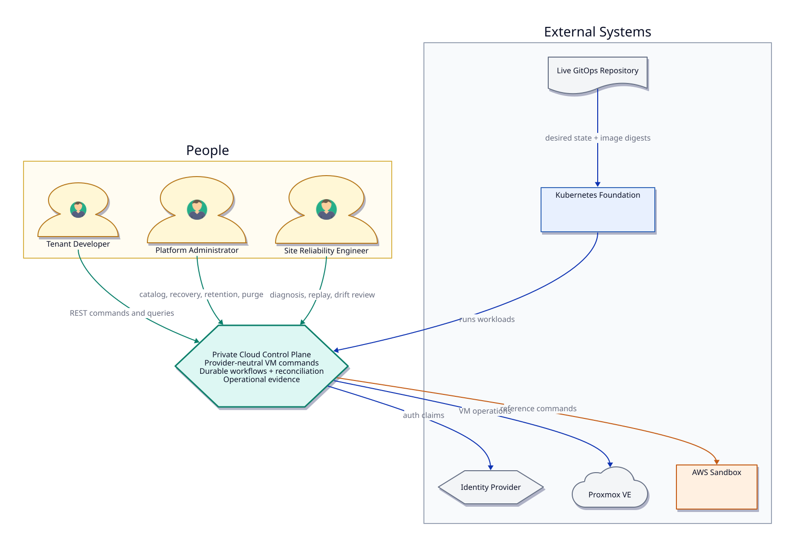
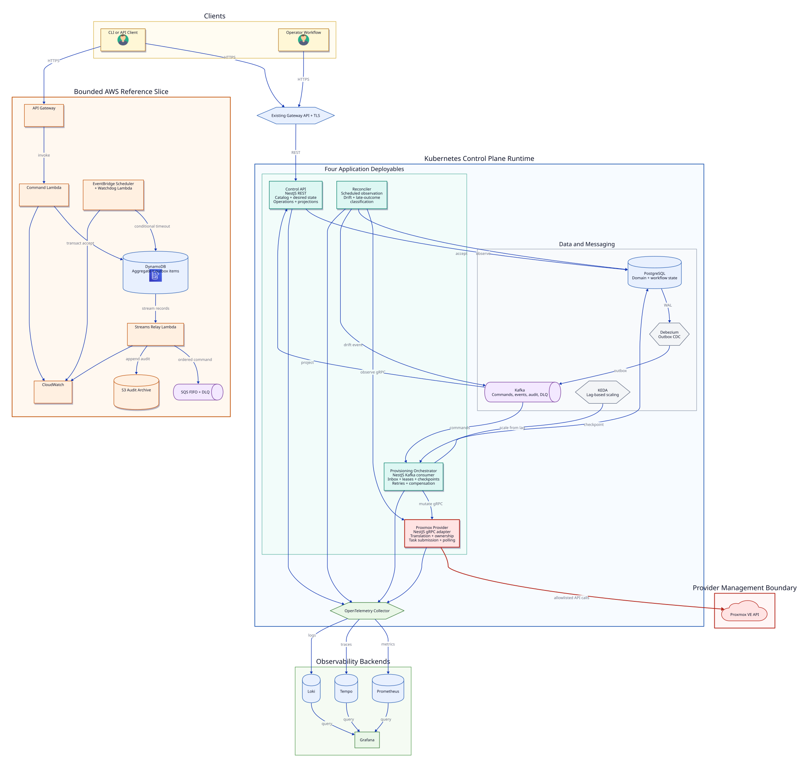

# C4 Architecture Model

## Level 1: System Context

[D2 source](../diagrams/c4/system-context.d2)

### Context Responsibilities

| Relationship | Contract |
| --- | --- |
| People to control plane | Provider-neutral resources and operation IDs; no provider credentials or identifiers |
| Control plane to identity provider | Authentication and claims only; identity lifecycle is external |
| Control plane to Proxmox | Provider adapter is the only mutating path |
| Live repository to foundation | Reviewed declarative desired state and immutable image digests |
| Control plane to AWS sandbox | Same domain identity and event concepts, bounded to command acceptance and publication |

## Level 2: Container View

[D2 source](../diagrams/c4/container-view.d2)

### Container Rules

1. The four application deployables are Control API, Provisioning Orchestrator, Proxmox Provider, and Reconciler. Datastores, brokers, operators, and telemetry components are platform dependencies rather than additional application services.
2. The Control API is the only public application container.
3. The Proxmox Provider is the only container permitted to know Proxmox request and response types or hold a Proxmox credential reference.
4. The accepting API writes PostgreSQL and never depends synchronously on Kafka or Proxmox.
5. Debezium publishes committed outbox records. It does not own domain decisions.
6. The orchestrator owns execution state, not public resource definitions.
7. The reconciler observes and classifies. It does not perform destructive correction.
8. KEDA can change consumer replica count, while an independent concurrency control protects the provider.
9. Telemetry export failure must not sit on a command or provider critical path.
10. The AWS slice is a contract and reliability comparison, not a second provider execution plane.

## Deployment Ownership

| Element | Source ownership |
| --- | --- |
| Four application containers and shared packages | `private-cloud-control-plane` |
| Container images | Built from `private-cloud-control-plane` and addressed by digest |
| Kubernetes resources, platform dependencies, dashboards, and alerts | `private-cloud-platform-live` |
| RKE2, Cilium, Gateway, TLS, Longhorn, and Argo bootstrap | `private-cloud-foundation` |
| AWS Terraform and its verification artifacts | `private-cloud-platform-live` |
