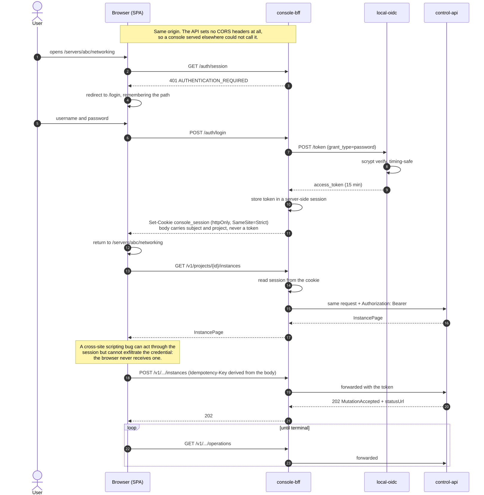

# Customer console

The web console for tenants, at `apps/console-web` (the single-page app) and `apps/console-bff`
(the server that holds its session and proxies the API).

## What it is built on, and what it is not

The visual language came with the design and is kept: a neutral grey ramp with one red brand hue,
Inter at a 16px base, a 14rem navigation rail, 2rem card padding, and a disabled primary button
that stays red rather than going grey — an unavailable primary action should still read as the
primary action.

What changed is everything behind it. The console arrived with one live API call, a localStorage
mock that simulated provisioning with `setInterval`, and a catalog of another provider's flavours
and datacentres priced in euros. It now reads the control plane and nothing else.

## The session, and why there is a server

`control-api` sets no CORS headers at all, so a console served from another origin cannot call it.
That alone would justify a reverse proxy. What justifies a *process* is the credential.

A tenant token is a bearer credential for the whole control plane: anything holding it can create
and destroy servers. `console-bff` keeps it in a server-side session and gives the browser an
opaque, httpOnly, `SameSite=Strict` cookie. A cross-site scripting bug can act *through* the
session, but it cannot exfiltrate the credential to use later or elsewhere — which matters for an
application that shipped with fifteen `react-router` XSS and open-redirect advisories.

Readiness depends on `control-api` and deliberately **not** on the identity provider. An issuer
outage stops new sign-ins and leaves existing sessions working; failing readiness for it would turn
a partial outage into a total one.

### The identity stub verifies now

`apps/control-api/tools/local-oidc.mjs` previously exposed one endpoint —
`GET /token?roles=…&projects=…` — which minted a signed token for whatever was asked, with no
credential of any kind. That is right for the verification scripts and wrong as the thing a login
page talks to: a console in front of it would be theatre, where typing anything returns
administrator.

It now also serves `POST /token` with the password grant, verifying a scrypt hash before minting.
`GET /token` is unchanged, because `tools/verification/verify-*.mjs` depend on it, and is
documented as development-only above its handler. A password grant is deprecated in OAuth 2.1 and
is not what production should use; it is the only grant that lets the console own its own sign-in
screen, which is why a development stub has one.

## Obligations the console carries

| Invariant | What the console does |
| --- | --- |
| SAFE-008/009 | Derives the `Idempotency-Key` from the canonical request, so a retry of the same intent carries the same key. A fresh key per attempt — which is what it did before — turns a timed-out-but-accepted request into duplicate work |
| SAFE-026 | Refuses a disk shrink in the rescale form, before the request is sent |
| SAFE-028 | Presents delete as a retained soft delete, says the machine is not destroyed, and asks for the hostname to be typed |
| SAFE-006 | Does not expose purge at all; it is administrative and requires proven live ownership |
| SAFE-032 | Renders `ProblemDetails.detail`, which the contract classifies tenant-safe, and shows `traceId` as a support reference |

## Honest absences

The contract has no traffic accounting, no network zones, no labels, no reverse DNS, no IPv6
allocator and no snapshot size. The view model uses `null` for those rather than a zero, because a
console that cannot distinguish "measured as zero" from "not measured" reports hardware that does
not exist — and the previous version did, showing `0.000 TB` of traffic against a 20 TB allowance
and a snapshot size computed as 2.1% of the server's disk.

Sections with no endpoint behind them keep their place in the navigation and are marked **on the
roadmap**: volumes, firewalls, private networks, DNS, object storage, storage boxes, placement
groups, floating IPs, automatic backups, per-server metrics, rescue, ISO images and the VNC
framebuffer. An empty state and an unbuilt feature look identical to a user and mean entirely
different things.

Two of those previously looked finished and persisted only to the browser — floating IPs had a full
CRUD surface over `localStorage`, and automatic backups had a seven-slot rotation. Both are now
inert. The original design is recoverable from the `console-web-original` tag.

## Prices

Prices are kept, keyed by real flavour identifiers, because billing is planned work rather than an
excluded concern. A flavour with no entry reads as unpriced rather than free. The figures that came
with the design belonged to another provider and have been replaced.

## Running it

See [the operations note](../operations/console-operations.md).
