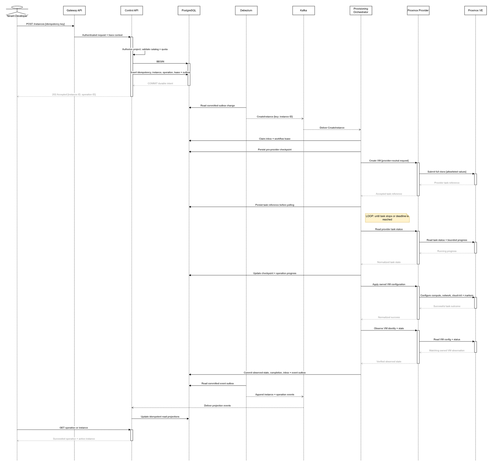

# Create Instance Success Sequence

## Sequence

[Open the editable Draw.io source](../diagrams/src/create-instance-success.drawio).

## Success Invariants

| Point | Required invariant |
| --- | --- |
| API acknowledgement | Instance, operation, idempotency record, lease, and outbox are committed together |
| Kafka publication | Command event ID is stable and instance ID is the partition key |
| Consumer start | Inbox receipt and instance workflow lease are claimed transactionally |
| Provider submission | Provider profile values are server-side and pass the lab boundary |
| Provider task polling | Task reference exists durably before the first poll |
| Provider completion | Success is not assumed from transport success; live owned state is observed |
| Domain completion | Observed state, operation outcome, inbox completion, and result event outbox commit atomically |
| Projection | Duplicate result events produce the same read model |

## Response Semantics

- The initial response is `202 Accepted`; it means durable intent exists, not that a VM exists.
- The operation remains accepted while Kafka is unavailable.
- Progress is stage-oriented and bounded. Raw provider task logs are not a public API contract.
- A terminal `succeeded` state requires observed ownership and state evidence.
- The tenant never receives provider node, template VMID, storage, bridge credential, session token, or raw provider task identifiers.
