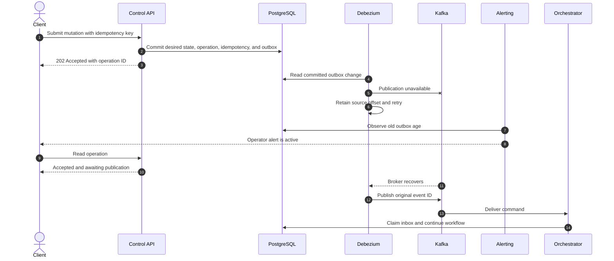
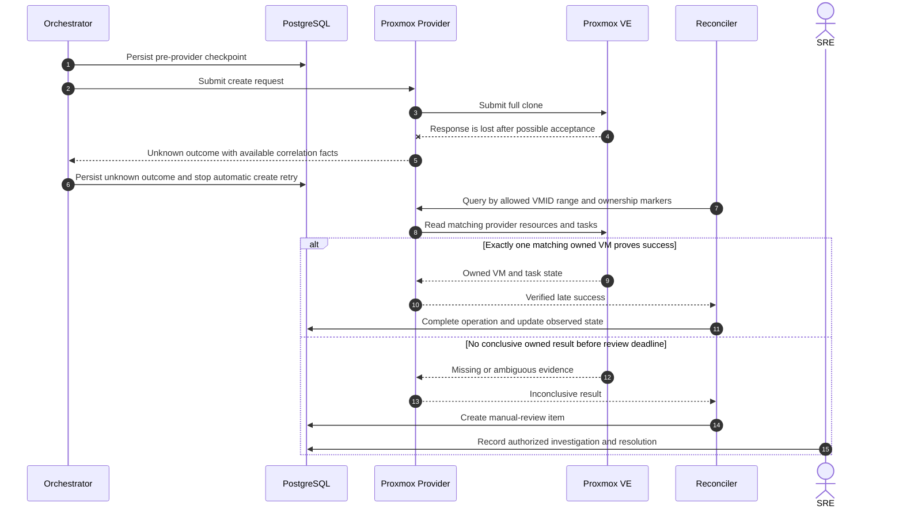
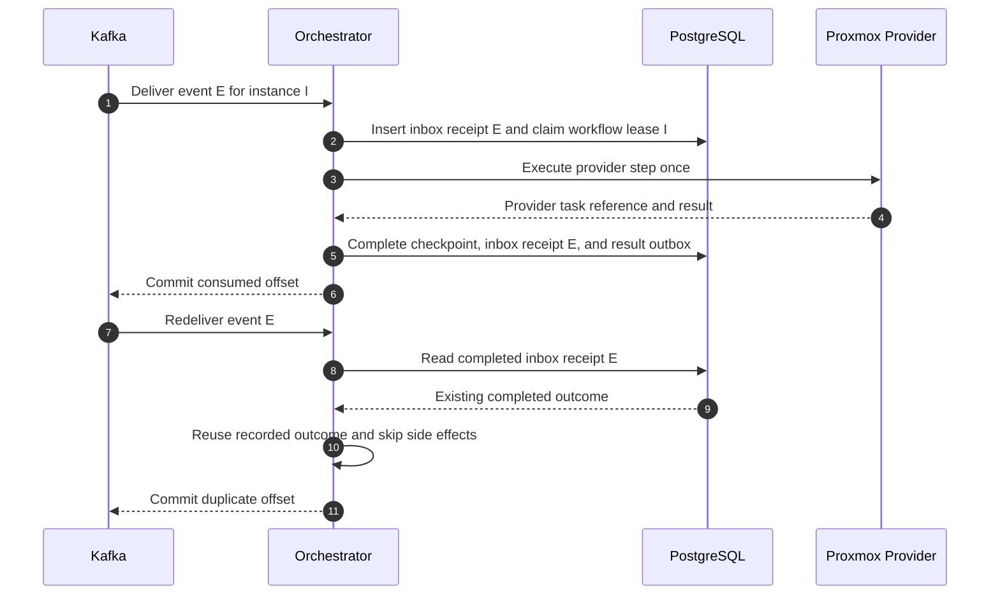
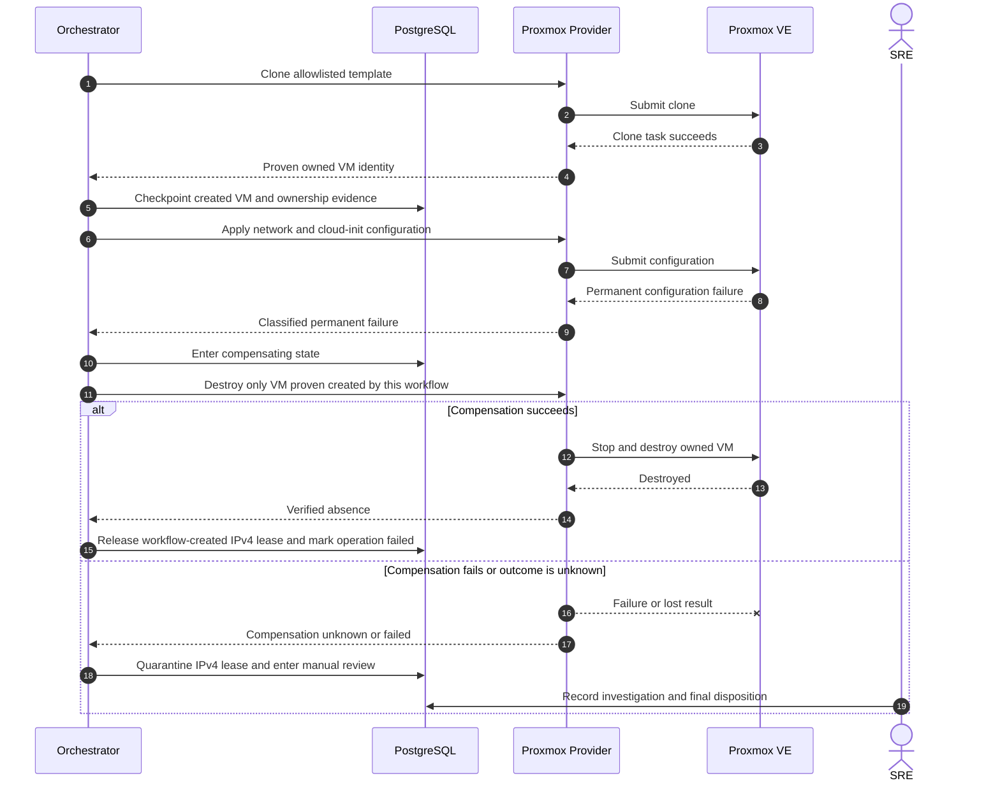

# Failure Sequences

## Kafka Unavailable After Command Acceptance

Required behavior:

- A committed command is not rolled back because Kafka is unavailable.
- The API does not publish directly and remains independent of broker latency.
- Debezium does not advance past unpublished work.
- Oldest outbox age and connector errors alert before storage exhaustion.
- Recovery publishes the original event identity; it does not manufacture a new command.

## Provider Timeout and Unknown Outcome

Required behavior:

- Transport timeout is not interpreted as provider failure.
- Create is not resubmitted while the outcome is unknown.
- Reconciliation uses immutable ownership markers and the allowlisted VMID range, not VM name alone.
- Only conclusive observed evidence may convert the operation to success or confirmed failure.
- Ambiguity remains visible and requires an attributable operator decision.

## Duplicate Kafka Message

Required behavior:

- The event ID, not the Kafka offset, is the durable deduplication identity.
- The inbox record stores enough outcome data to answer a duplicate deterministically.
- The duplicate path does not call the provider or emit a second logical result event.
- A crash before inbox completion resumes the checkpointed workflow rather than treating the event as new.

## Configuration Failure and Compensation

Required behavior:

- Compensation begins only after the workflow has durable proof that it created the target resource.
- Provider cleanup cannot target a pre-existing or unowned VM.
- Successful compensation releases only the lease created by the failed workflow.
- Failed or unknown compensation preserves the original error, records the cleanup error separately, and quarantines the lease.
- A compensation failure is not retried destructively without fresh ownership and observed-state verification.
