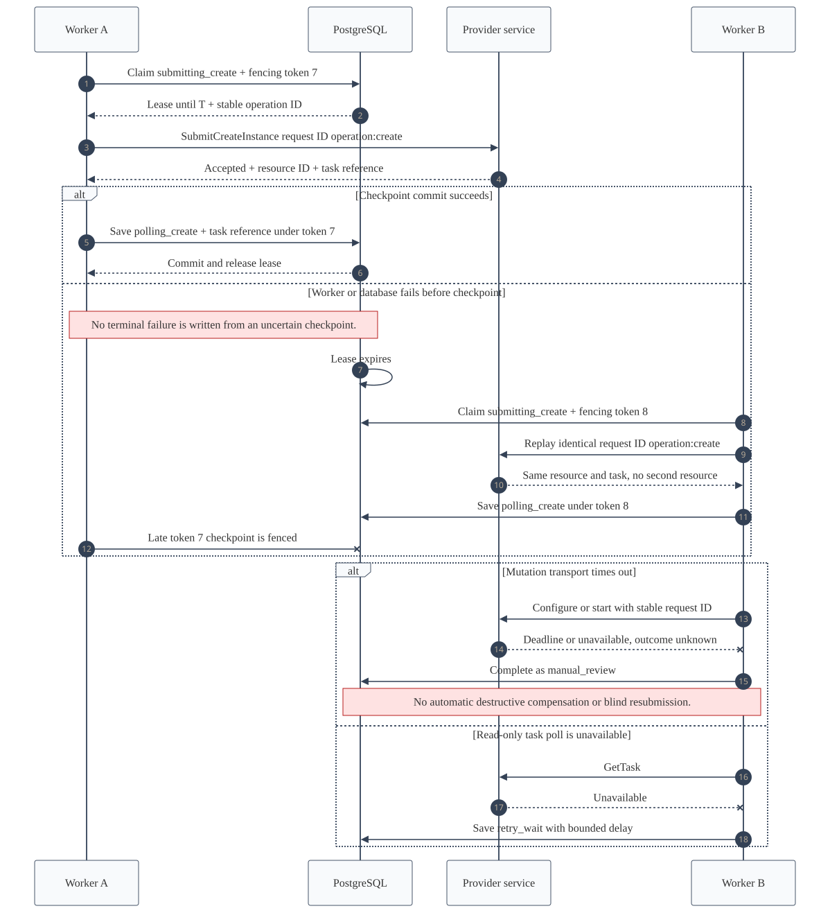

# Phase 3 Synchronous Vertical Slice

## Implemented Boundary

Phase 3 implements one complete create-instance path without Kafka. REST and public gRPC accept the same provider-neutral intent, PostgreSQL commits it durably, the orchestrator polls the transactional outbox, the provider service executes a fake or explicitly selected Proxmox adapter over internal gRPC, and the control API projects workflow events for readback.

The temporary database pollers are behind `WorkflowStore` and `ProjectionStore` ports. Phase 4 replaces their transport role with Debezium and Kafka while preserving command receipts, workflow checkpoints, fencing, event contracts, and projection behavior.

## Code Map

| Component | Implementation | Responsibility |
| --- | --- | --- |
| Public API | `apps/control-api` | OIDC authentication, project authorization, REST/public gRPC mapping, acceptance and readback |
| Domain/application | `packages/domain`, `packages/application` | Validation, canonical idempotency hash, command handling, provider-neutral workflow transitions |
| Persistence | `packages/postgres-adapter` | Acceptance transaction, inbox receipts, leases, fencing tokens, checkpoints, workflow outbox, ordered projections |
| Orchestrator | `apps/provisioning-orchestrator` | Ordered polling, one leased transition per claim, provider gRPC calls, process lifecycle |
| Provider service | `apps/proxmox-provider` | Internal provider gRPC boundary and runtime adapter selection |
| Provider adapters | `packages/provider-adapters` | Deterministic fake and allowlisted Proxmox API translations |
| Provider port | `packages/provider-sdk` | Provider-neutral Phase 3 and full lifecycle interfaces plus transport errors |

## Request And Workflow

The active workflow stages are persisted, not inferred from logs or process memory.

| Stage | External action | Persisted result | Next safe action |
| --- | --- | --- | --- |
| `accepted` | None | Pre-call checkpoint | Submit create |
| `submitting_create` | `SubmitCreateInstance` | Resource ID and task reference, or synchronous success | Poll clone or configure |
| `polling_create` | `GetTask` | Running delay or terminal state | Poll again or configure |
| `configuring` | `ApplyInstanceConfiguration` | Configuration task reference or synchronous success | Poll configuration or start |
| `polling_configuration` | `GetTask` | Running delay or terminal state | Poll again or start |
| `starting` | `StartInstance` | Start task reference or synchronous success | Poll start or observe |
| `polling_start` | `GetTask` | Running delay or terminal state | Poll again or observe |
| `observing` | `ObserveInstance` | Exact ownership and running-state evidence | Complete or require manual review |

## Recovery Semantics

- The inbox hashes the accepted command and records its event ID once.
- Each instance has one lease with a monotonically increasing fencing token.
- Every provider mutation has a stable request ID derived from operation and stage.
- A database failure after a provider call is not converted into a terminal business failure. The lease expires and the identical provider request can be replayed.
- Stale workers cannot checkpoint after a newer fencing token is issued.
- Read-only provider failures enter delayed retry. Ambiguous mutation transport and unknown task results enter `manual_review`.
- Projection receipts are idempotent, and the query admits only the earliest unconsumed event for each aggregate.
- No failure path automatically stops, deletes, purges, or otherwise destructively compensates a VM.

## Proxmox Adapter

The Proxmox implementation is limited to the create call map. It uses HTTPS with the platform trust store, API-token authentication, form-encoded mutations, encoded UPID reads, one configured node, one template, one storage target, one bridge, one network, and VMIDs inside `910000-910099`.

| Configuration | Purpose | Constraint |
| --- | --- | --- |
| `PROVIDER_ADAPTER` | Runtime selection | `fake` by default; `proxmox` must be explicit |
| `PROXMOX_ENDPOINT` | API root | HTTPS only; certificate and hostname verification remain enabled |
| `PROXMOX_API_TOKEN_ID` | Least-privilege token identity | Required only in Proxmox mode |
| `PROXMOX_API_TOKEN_SECRET` | Token secret | Required only in Proxmox mode; never logged or returned |
| `PROXMOX_PROVIDER_PROFILE_ID` | Server-side profile allowlist | Must match provider call context |
| `PROXMOX_CLUSTER_ALIAS` | Logical cluster identity | Deployment-supplied lab value |
| `PROXMOX_NODE` | Compute target | Exactly one node |
| `PROXMOX_TEMPLATE_VMID` / `PROXMOX_IMAGE_ID` | Image source | Exactly one template and public image slug |
| `PROXMOX_STORAGE` | Full-clone target | Exactly one storage identifier |
| `PROXMOX_BRIDGE` | Guest attachment | Existing bridge only; no host or SDN mutation |
| `PROXMOX_NETWORK_ID` | Control-plane network | Must match the accepted command |
| `PROXMOX_IPV4_CIDR` / `PROXMOX_IPV4_GATEWAY` | Guest network boundary | Address, prefix, and gateway must match |
| `PROXMOX_VMID_MINIMUM` / `PROXMOX_VMID_MAXIMUM` | Resource interval | Must remain within `910000-910099` |
| `PROXMOX_PROJECT_ID` | Tenant boundary | Must equal the fixed lab project UUID |

The adapter never calls `/cluster/nextid`. It searches only the allowlisted node and reserved interval, recognizes retries through exact ownership metadata, preserves inherited `net0` model/MAC/options, omits blank SSH keys and all password fields, and accepts a task only when it is stopped with `exitstatus=OK`. The exhaustive HTTP map is in [Proxmox Create Call Map](proxmox-create-call-map.md).

## Active Contracts

The implemented REST/public gRPC subset, request fields, authentication metadata, and error mappings are tabulated in [Phase 3 API Implementation](../contracts/phase-3-api.md). The provider service activates these RPCs:

| RPC | Fake | Proxmox | Phase 3 use |
| --- | --- | --- | --- |
| `ValidateProfile` | Implemented | Allowlist probes | Activation evidence |
| `GetCapabilities` | Implemented | Bounded create capabilities | Capability discovery |
| `SubmitCreateInstance` | Implemented | Full clone | Create workflow |
| `ApplyInstanceConfiguration` | Implemented | CPU, memory, `net0`, cloud-init network, optional SSH keys | Create workflow |
| `GetTask` | Implemented | One UPID status read | Non-blocking polling |
| `ObserveInstance` | Implemented | Config, status, and ownership reads | Completion proof |
| `StartInstance` | Implemented | Owned VM start | Create workflow |

The remaining provider lifecycle RPCs stay in the versioned contract but are not registered by the Phase 3 service.

## Verification

Automated checks cover canonical create validation, concurrent idempotent acceptance, fake-provider duplicate behavior, post-mutation checkpoint replay, Proxmox TLS and VMID guards, clone parameters, ownership metadata, NIC preservation, password/blank-key omission, and task terminal semantics.

The local integration run used PostgreSQL and three built service processes. A fresh REST command returned `202`, traversed 11 persisted claims, completed three fake provider tasks, passed final ownership observation, and read back `operation.state=succeeded` with `instance.lifecycleState=active`. Replaying the identical idempotency key returned the same operation and target identifiers with `replayed=true`; no second provider resource was created. No live Proxmox request was executed.

## Deliberate Limitations

- Kafka, Debezium, DLQ, and administrative replay begin in Phase 4.
- The fake adapter is in-memory and intended for deterministic tests and local execution, not durable provider simulation.
- The terminal provisioning event proves existence, running power, and marker match but does not carry observed resource sizes. Those projection fields remain `null` until the observation contract is extended in the reconciliation phase.
- Live profile activation, power operations beyond create-time start, resize, snapshots, retention, purge, and reconciliation are outside Phase 3.
- Proxmox code is implemented and unit-tested with HTTP fixtures; live mutation remains operator-gated.
