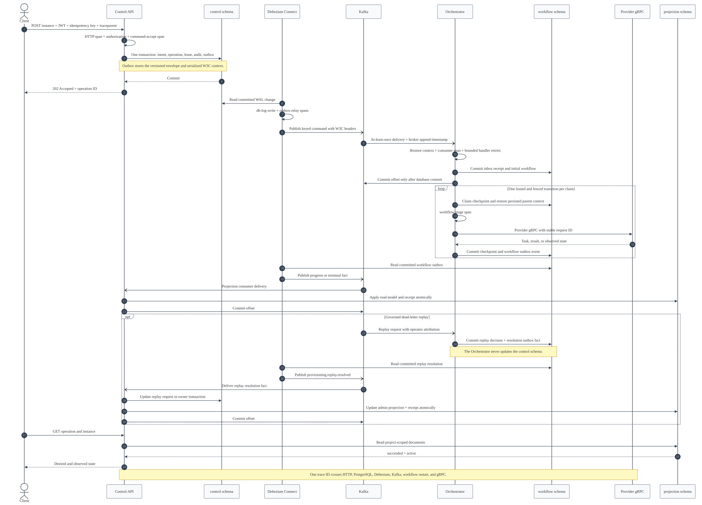

# Phase 4 Messaging and Observability

Phase 4 replaces the temporary database-to-database polling path with an asynchronous control
plane. PostgreSQL remains authoritative, Debezium relays committed outbox rows, Kafka provides
retained at-least-once delivery, and consumers commit offsets only after durable handling. The same
request trace crosses HTTP or gRPC, PostgreSQL, CDC, Kafka, the workflow, provider gRPC, and the read
projection.

[Open the Mermaid source](../diagrams/mermaid/phase-4-event-journey.mmd).

## Runtime Topology

| Component | Responsibility | State or protocol |
| --- | --- | --- |
| Control API | Authorize requests, commit tenant intent, serve project-scoped read models, administer dead letters | REST, public gRPC, `control` and `projection` schemas |
| Debezium Connect | Read committed outbox changes and route them without service-owned dual writes | PostgreSQL logical decoding to Kafka |
| Kafka | Retain versioned commands and facts and preserve same-instance ordering | Six partitions per topic locally; at-least-once delivery |
| Provisioning Orchestrator | Admit commands, deduplicate deliveries, run leased workflows, and publish progress or terminal facts | Kafka consumer, `workflow` schema, provider gRPC client |
| Proxmox Provider | Isolate provider credentials and implement the provider-neutral lifecycle port | Internal gRPC; deterministic fake or allowlisted Proxmox adapter |
| Reconciler | Reserved owner of observation and drift facts | Instrumented process shell in this phase |
| OpenTelemetry Collector | Receive OTLP traces and metrics, batch them, and expose backend-specific outputs | OTLP gRPC/HTTP, Tempo exporter, Prometheus exporter |
| Alloy, Loki, Tempo, Prometheus, Grafana | Collect logs and retain/query operational evidence | Structured logs, traces, metrics, correlated dashboard views |

The local stack creates the complete contract topology even where later phases have not activated a
consumer:

| Topic | Active Phase 4 path | Partition key |
| --- | --- | --- |
| `provisioning.commands.v1` | Control API to Provisioning Orchestrator | Instance ID |
| `provisioning.events.v1` | Provisioning Orchestrator to Control API projection | Instance ID |
| `provisioning.dlq.v1` | Provisioning Orchestrator to Control API administrator projection | Instance ID |
| `reconciliation.events.v1` | Contract reserved for the Reconciler and Control API | Instance ID |
| `audit.events.v1` | Contract reserved for the audit archive | Aggregate partition key |

Kafka topic names and message schemas are versioned independently. A topic version is not permission
to accept every schema version carried on it; each consumer rejects contracts it does not understand.

## Monorepo Boundaries

| Project | Phase 4 ownership |
| --- | --- |
| `packages/contracts` | AsyncAPI source, JSON Schema, generated event types, and delivery metadata |
| `packages/application` | Provider-neutral use cases, workflow ports, event validation, and telemetry port |
| `packages/postgres-adapter` | Owner transactions, inboxes, outboxes, checkpoints, dead letters, replay, and backlog reads |
| `packages/messaging` | Envelope trust boundary and explicitly committed Kafka consumer runner |
| `packages/observability` | Process SDK lifecycle, W3C context helpers, spans, structured logs, and instruments |
| `apps/control-api` | Command producer transaction, event/DLQ consumers, projections, and replay API |
| `apps/provisioning-orchestrator` | Command/replay consumer and resumable workflow scheduler |
| `apps/proxmox-provider` | Instrumented internal provider gRPC boundary |
| `apps/reconciler` | Instrumented process entry point; event production remains later work |
| `deploy/local` | Reproducible local Kafka, CDC, and observability evidence environment |

`application` depends on ports, not Kafka, PostgreSQL, NestJS, or the OpenTelemetry SDK. The NestJS
modules are composition roots: they bind application ports to adapters and own runtime lifecycle.

## Command and Event Flow

1. The Control API validates authentication, project scope, request identity, and payload.
2. One `control` transaction commits intent, operation state, resource lease, audit evidence, and a
   versioned outbox envelope. Only then does the API return `202 Accepted`.
3. Debezium reads the committed WAL change. Its outbox router sends the declared payload, event ID,
   partition key, replay generation, and W3C headers to the allowlisted Kafka topic.
4. The Orchestrator validates the Kafka key, identity headers, replay generation, envelope, and
   supported command payload. One `workflow` transaction records the inbox receipt and creates the
   initial workflow.
5. Kafka's next offset is committed only after that transaction commits. Provider work is not done
   while the Kafka record is held.
6. A worker claims one checkpoint with a lease and monotonic fencing token, calls the provider with
   a stable request identity, and commits the next checkpoint plus its outbox fact.
7. Debezium publishes progress and terminal facts. The Control API atomically applies each fact and
   records its projection receipt before committing the Kafka offset.
8. Reads return only project-scoped projection documents.

The two durable identities serve different failure domains. `outbox_id` identifies one physical CDC
row. `(consumer_name, event_id, replay_generation)` identifies one permitted logical delivery. A
normal broker duplicate remains generation zero and cannot repeat a provider effect.

## Failure and Recovery

[Open the Mermaid source](../diagrams/mermaid/phase-4-failure-recovery.mmd).

Envelope, transport metadata, or permanent contract failures receive bounded handler attempts. An
envelope or replay-generation header that cannot be trusted is quarantined by payload hash and broker
coordinates; raw poison bytes are never copied into logs or telemetry. A valid but unsupported
command becomes an outbox-backed dead-letter fact.
Infrastructure and programming failures are not dead-lettered: their offsets remain uncommitted so
the dependency can recover and Kafka can redeliver.

Replay is a new, authorized command, not a raw topic copy. The Control API requires a platform
administrator, a reason, and an idempotency key. A replayable dead letter can advance to a higher
generation only if the current deployment validates the stored original contract. An incompatible
request is consumed and marked `rejected`, while the original dead letter remains open for a later,
fresh attributed request. A non-replayable record is rejected synchronously with
`REPLAY_NOT_ALLOWED`.

The Orchestrator records the decision in its own transaction and publishes
`provisioning.replay.resolved` through its outbox. The Control API consumes that fact to update the
replay request and administrator projection. Neither component writes the other component's state.

A worker crash cannot erase its last provider task reference. After the lease expires, another worker
claims a higher fence and resumes the persisted task instead of creating a second resource.

## End-to-End Telemetry

[Open the Mermaid source](../diagrams/mermaid/phase-4-telemetry-pipeline.mmd).

Each Node.js entry point registers OpenTelemetry before importing NestJS, database, Kafka, or gRPC
runtime modules. W3C `traceparent` and optional `tracestate` are bounded and persisted in the event
envelope, Debezium carrier column, and workflow checkpoint. Consumers and resumed workflow stages
restore that parent into short-lived spans. No span is held open while work waits in Kafka, sleeps for
retry, or waits for a provider task.

Services export traces and metrics through OTLP to the Collector. The Collector batches traces into
Tempo and exposes one Prometheus scrape endpoint. Applications do not push to Prometheus and do not
depend on a telemetry backend for correctness. Alloy sends one-line JSON service logs to Loki;
`trace_id` and `span_id` support trace-to-log navigation in Grafana.

The custom metric surface is deliberately low-cardinality:

| Instrument | Operational question |
| --- | --- |
| `controlplane.command.accepted` | Which command outcomes were durably accepted? |
| `controlplane.messaging.processed` | Were deliveries handled, duplicated, dead-lettered, or quarantined? |
| `controlplane.messaging.queue_residence` | How long did a record wait after broker append? |
| `controlplane.outbox.publish_delay` | How long elapsed between domain occurrence and broker append? |
| `controlplane.outbox.pending` | How many owner outbox rows have no durable consumer result? |
| `controlplane.outbox.oldest_age` | How old is the oldest pending owner record? |
| `controlplane.workflow.transition`, `controlplane.workflow.retry` | How is workflow execution progressing? |
| `controlplane.provider.operation.duration` | How long do provider operations take by operation and outcome? |
| `controlplane.projection.apply.duration` | How long do projection transactions take by schema and outcome? |
| `controlplane.dead_letter`, `controlplane.quarantine`, `controlplane.replay` | Which governed recovery paths are active? |

Metric attributes are bounded classifications only. Project, instance, operation, event, resource,
provider-task, address, credential, and tenant-configuration values may be trace or restricted log
fields where allowed, but are never metric labels.

## Scope Boundary

This phase proves the asynchronous create-instance path with the deterministic provider and a local
single-broker evidence stack. It does not claim production Kafka replication, Kubernetes or KEDA
deployment, SLOs and alerts, load-test capacity, database failover, an active reconciliation loop, or
a live Proxmox mutation. Those require their own deployment and measured verification phases.

See [Phase 4 Persistence and Delivery Identity](phase-4-persistence.md), the
[failure recovery runbook](../runbooks/phase-4-failure-recovery.md), and the
[local verification record](../verification/phase-4-local-verification.md).
