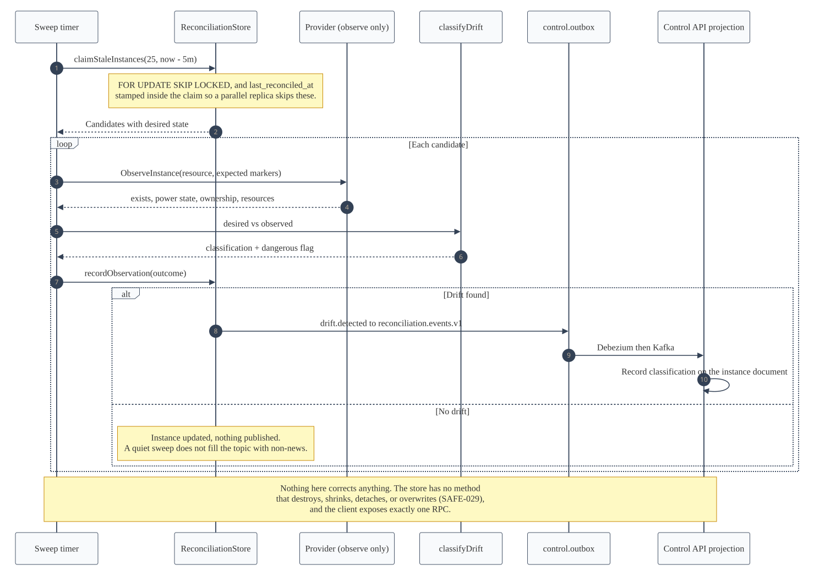

# Phase 5 Lifecycle Capabilities

## Purpose

Phase 4 delivered one capability end to end: create an instance. Phase 5 ports the other eight,
each against the contract that was already frozen in Phase 2. This document records what each one
does, the Proxmox calls it makes, and the rule that keeps it safe.

The ordering is the roadmap's, and it is the order of increasing blast radius: reads first, then
reversible mutations, then deletion and purge.

## The shared engine

Every capability is a persisted saga sharing `LifecycleWorkflow`. A capability supplies three
things and inherits everything else:

| Supplied per capability | Inherited from the engine |
| --- | --- |
| The stage table its `execute` dispatches on | Claiming under a lease with a fencing token |
| Its **mutation stages** | Retry with full jitter, bounded at 8 attempts and 15 minutes |
| The provider calls each stage makes | Governed dead-lettering and checkpointing |
| | Ownership markers, call context, and event envelopes |

**Mutation stages are the safety-critical part.** `handleProviderError` routes a transport failure
in a mutation stage to `manual_review` instead of retrying it, because an unknown outcome there
means the provider may already have acted. A capability that inherited another's set would retry a
mutation that had already been applied. Each capability declares its own, and each has a test
asserting the exact set.

[Open the Mermaid source](../diagrams/mermaid/phase-5-capability-stages.mmd). Red stages are
mutations; blue is purge's verification gate, the only stage in the system placed before a mutation
purely in order to refuse.

## The nine capabilities

| # | Capability | Action | Mutation stages | Provider calls |
| --- | --- | --- | --- | --- |
| 1 | Observed status | (read path) | none | `ObserveInstance` |
| 2 | Power | `power_instance` | `submitting_power` | `Start`/`Shutdown`/`Stop`/`RebootInstance` |
| 3 | Compute resize | `resize_instance` | `submitting_resize` | `ResizeInstance` |
| 4 | Disk growth | `resize_instance` | `submitting_resize` | `ResizeInstance` |
| 5 | IPv4 lease release | (store operation) | none | none |
| 6 | Snapshots | `create_snapshot`, `rollback_snapshot`, `delete_snapshot` | `submitting_snapshot` | `List`/`Create`/`Rollback`/`DeleteSnapshot` |
| 7 | Soft deletion | `retain_instance` | `submitting_retention` | `MarkInstanceRetained` |
| 8 | Administrative purge | `purge_instance` | `submitting_purge` | `PurgeInstance` |
| 9 | Reconciliation | (sweep) | none | `ObserveInstance` |

## Proxmox call map

Extends [Proxmox Create Call Map](proxmox-create-call-map.md), which covers capability 0.

| Capability | Method and path | Notable behaviour |
| --- | --- | --- |
| Power | `POST /nodes/{node}/qemu/{vmid}/status/{start\|shutdown\|stop\|reboot}` | `stop` sends `overrule-shutdown=1`, without which Proxmox refuses while a graceful shutdown task holds the VM |
| Compute resize | `POST /nodes/{node}/qemu/{vmid}/config` with `cores`, `sockets=1`, `vcpus`, `memory` | Returns a task only when the VM is running; an empty result is synchronous success |
| Disk growth | `PUT /nodes/{node}/qemu/{vmid}/resize` with `disk` and absolute `size=NG` | **PUT, not POST** — Proxmox does not implement POST on this endpoint. Never a `+N` delta |
| Snapshot list | `GET /nodes/{node}/qemu/{vmid}/snapshot` | The synthetic `current` entry is filtered out |
| Snapshot create | `POST /nodes/{node}/qemu/{vmid}/snapshot` with `snapname`, `vmstate=0` | Disk-only by design; capturing RAM would make rollback restore a running memory image |
| Snapshot rollback | `POST .../snapshot/{name}/rollback` with `start=1` | Leaves the instance usable rather than stopped |
| Snapshot delete | `DELETE .../snapshot/{name}` | — |
| Soft deletion | `POST .../config` with `description`, `onboot=0`, `delete=ipconfig0` | Removes no disk. Ownership markers are **preserved** so a later purge can prove identity |
| Purge | `DELETE /nodes/{node}/qemu/{vmid}?purge=1&destroy-unreferenced-disks=1` | Query-string parameters; Proxmox ignores them in a DELETE body. Stops a running VM first |

Two behaviours are honoured across every mutating call, and neither appears in the reference
module this API knowledge was drawn from:

- **The config `lock` field is read before acting.** A locked VM is classified as *transient*, not
  permanent: the lock belongs to another Proxmox operation and clears on its own, so
  dead-lettering it would fail a request that would have succeeded seconds later.
- **`qmpstatus` is read alongside `status`.** `status` stays `running` while a guest is paused, so
  `qmpstatus` is the only way a suspended VM is detectable.

## Purge, guard by guard

[Open the Mermaid source](../diagrams/mermaid/phase-5-purge-guards.mmd). Four guards in three
places, and the only path to the destructive call runs through all of them. Note the two exits that
are neither success nor failure: an instance already absent completes without a destructive call,
and unproven ownership goes to an operator rather than to a retry.

## Reconciliation

[Open the Mermaid source](../diagrams/mermaid/phase-5-reconciliation-sweep.mmd).

## Safety rules, and where each one lives

| Rule | Enforced in | Why there |
| --- | --- | --- |
| SAFE-010, one mutating workflow per instance | `lockInstanceForMutation`, at acceptance | The workflow lease only exists once a command is consumed; this closes the window before that |
| SAFE-026, disks grow but never shrink | Domain validator **and** the Proxmox adapter | The adapter is the last place that could still issue the irreversible call |
| SAFE-028, delete is soft | `RetainInstanceWorkflow` | Its terminal state is `retained`, and it calls nothing that removes a resource |
| SAFE-006, purge proves ownership twice | Acceptance transaction **and** `verifying_purge` | The database proves our record; only a provider call proves the live resource |
| SAFE-029, reconciliation never corrects destructively | `ReconciliationStore` and the reconciler's client | Neither port has a method that could express destruction |

## What is deliberately absent

- **No compensation path anywhere.** Every ambiguous outcome goes to `manual_review`. Nothing in
  Phase 5 automatically stops, deletes, or purges a VM in response to a failure.
- **No on-demand provider read behind a `GET`.** Observed status is refreshed by workflows and by
  the reconciliation sweep, both of which have a bounded provider budget.
- **No automatic drift correction.** Reconciliation reports; acting on a finding is a separate,
  attributed request.
