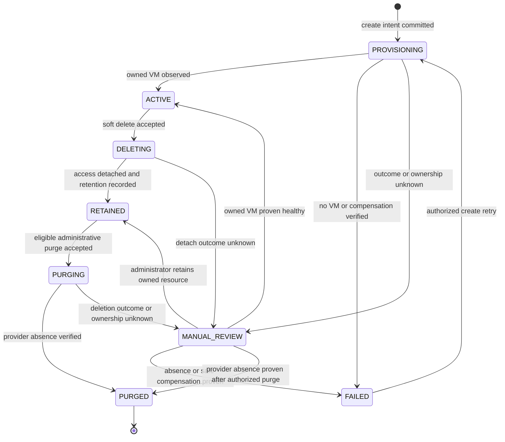
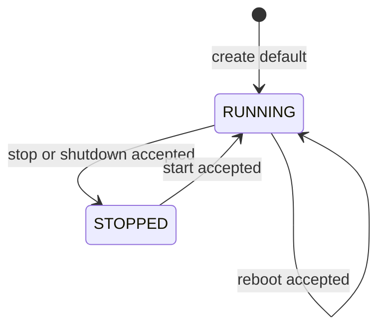
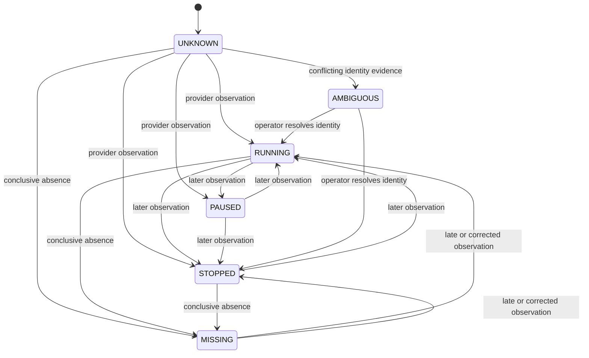
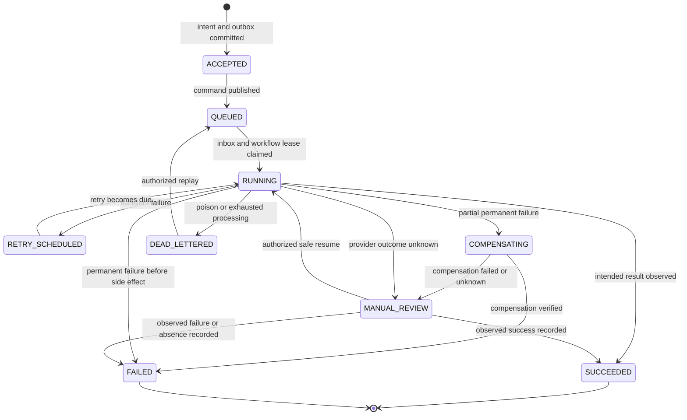

# State Machines

## Instance Lifecycle

| State | Meaning | Tenant mutation |
| --- | --- | --- |
| `PROVISIONING` | Create workflow is active or waiting for an asynchronous dependency | Denied except idempotent create readback |
| `ACTIVE` | An owned provider VM has been observed and routine lifecycle operations are allowed | Allowed subject to operation lease and quota |
| `FAILED` | Create conclusively failed and no provider resource remains under this workflow | Create retry may be requested |
| `DELETING` | Soft-delete workflow is detaching access and recording retention | Denied |
| `RETAINED` | Provider VM remains for review but tenant access is removed | Denied |
| `PURGING` | Explicit administrative destroy is running | Denied |
| `PURGED` | Provider absence is verified and lifecycle is terminal | Denied |
| `MANUAL_REVIEW` | Ownership or outcome is not safe to resolve automatically | Denied |

Power changes, resize, and snapshot operations do not change the instance lifecycle from `ACTIVE`. Their success or failure is represented by operation and observed state.

## Desired Power State

Desired power state records accepted intent. It does not prove the provider has reached that state.

## Observed Provider State

Observed state is evidence with a timestamp and provenance. Staleness is a property of the observation, not another provider state.

## Operation Lifecycle

| State | Meaning | Terminal |
| --- | --- | --- |
| `ACCEPTED` | Database commit succeeded; Kafka publication may still be pending | No |
| `QUEUED` | Command is published but execution has not begun | No |
| `RUNNING` | Consumer owns the workflow lease and is executing or polling | No |
| `RETRY_SCHEDULED` | A classified transient retry has a persisted due time | No |
| `COMPENSATING` | A proven partial side effect is being safely reversed | No |
| `DEAD_LETTERED` | Automated processing stopped and the event is retained for review/replay | No |
| `MANUAL_REVIEW` | Automation cannot safely decide or repeat the next side effect | No |
| `SUCCEEDED` | Intended result and ownership are observed | Yes |
| `FAILED` | Failure and any required compensation or absence are conclusive | Yes |

## State Invariants

1. An instance cannot be `ACTIVE` until an owned provider VM is observed.
2. An operation cannot be `SUCCEEDED` based only on message acknowledgement or an HTTP success status.
3. `ACCEPTED` is not a failure while the broker is unavailable.
4. A retry transition requires a classified transient failure and a persisted checkpoint.
5. An unknown provider outcome transitions to `MANUAL_REVIEW`, not directly to `FAILED`.
6. `PURGED` requires verified provider absence after an authorized purge.
7. A terminal operation is immutable; a new requested mutation receives a new operation ID.
8. Administrative replay preserves the original message identity but records a new replay audit fact.
