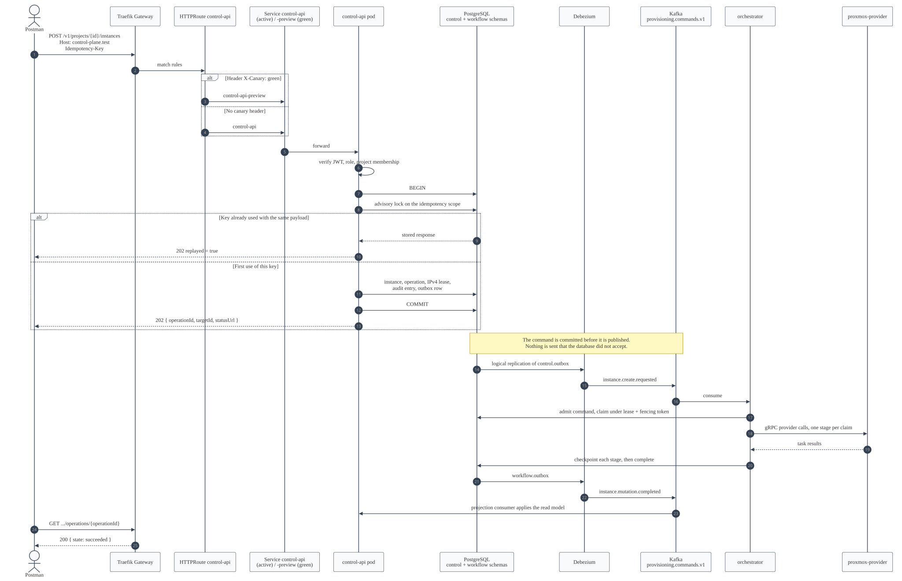

# Phase 6 API Examples

Every request the Postman collection makes, with the response the cluster actually returned.

Nothing here is illustrative. Each body below is transcribed from
`docs/verification/evidence/phase6-api-examples.json`, written by
`pnpm run postman:run` against the running deployment. Identifiers differ between runs; shapes,
status codes, and error codes do not.

**Last captured:** `2026-09-07T14:51:07Z` — 62 of 62 requests passed, 100 assertions, 1
skipped. The bodies below were transcribed from the equivalent run of `2026-09-06T20:41:43Z`;
only identifiers and timestamps differ between the two.

## Conventions

```bash
GATEWAY="http://$(minikube ip):30000"
PROJECT=00000000-0000-4000-8000-000000000001
```

Every request carries `Host: control-plane.test` so the Gateway's `HTTPRoute` matches. Every
`/v1/**` request carries `Authorization: Bearer <token>`; see
[getting a JWT](phase-6-operations-manual.md#getting-a-jwt).

Every **mutating** request additionally requires an `Idempotency-Key` header. It is not optional
and there is no default: without it a client retry after a timeout is indistinguishable from a
second request, which is how duplicate VMs get built.



## The asynchronous contract

No mutation returns the thing it changed. It returns `202 Accepted` with an operation to follow:

```json
{
  "operationId": "f3e97b73-01c1-441e-983e-55b60fefcb3f",
  "targetId": "d8d018cd-1537-4d56-8c25-db4ffb728b23",
  "acceptedAt": "2026-09-06T20:23:22.471Z",
  "statusUrl": "/v1/projects/00000000-0000-4000-8000-000000000001/operations/f3e97b73-01c1-441e-983e-55b60fefcb3f",
  "replayed": false
}
```

| Field | Meaning |
| --- | --- |
| `operationId` | The durable operation. Poll it; this is the only thing that reports completion |
| `targetId` | What the operation acts on — the new instance, or the new snapshot |
| `statusUrl` | Where to poll. Prefer following it to composing the path yourself |
| `replayed` | `true` when this key was already used with this exact payload; no new work started |

**`targetId`, not `resourceId`.** Composing subsequent requests from the wrong field yields
`/instances/undefined` and a `400`.

Poll until `state` leaves `accepted` and `running`:

```console
$ curl -s -H 'Host: control-plane.test' -H "Authorization: Bearer $TENANT" \
    "$GATEWAY/v1/projects/$PROJECT/operations/$OPERATION_ID"
```

```json
{
  "id": "f3e97b73-01c1-441e-983e-55b60fefcb3f",
  "stage": "completed",
  "state": "succeeded",
  "action": "create_instance",
  "targetId": "d8d018cd-1537-4d56-8c25-db4ffb728b23",
  "targetType": "instance",
  "projectId": "00000000-0000-4000-8000-000000000001",
  "acceptedAt": "2026-09-06T20:23:22.471Z",
  "startedAt": "2026-09-06T20:23:23.385Z",
  "completedAt": "2026-09-06T20:23:26.138Z",
  "updatedAt": "2026-09-06T20:23:26.138Z",
  "progressPercent": 100,
  "manualReviewRequired": false,
  "errorCategory": null,
  "errorCode": null,
  "errorMessage": null
}
```

**The field is `state`, not `status`.** `stage` is where in the workflow it is; `state` is whether
it is done.

| `state` | Meaning |
| --- | --- |
| `accepted` | Committed durably; the orchestrator has not claimed it yet |
| `running` | A worker holds the lease and is executing stages |
| `succeeded` | Done, and the provider confirmed it |
| `failed` | Terminal. `errorCode` and `errorCategory` say why |
| `manual_review` | The outcome could not be established safely. **No automatic retry, no automatic compensation.** An operator decides |

`manual_review` is not a failure mode to be worked around. It is what the system does instead of
guessing whether a mutation that timed out already built a VM.

## Health

Unauthenticated on purpose — a probe that needs a token cannot run from a kubelet.

```console
$ curl -s -H 'Host: control-plane.test' "$GATEWAY/health/live"
{"service":"control-api","status":"ok"}

$ curl -s -H 'Host: control-plane.test' "$GATEWAY/health/ready"
{"service":"control-api","status":"ok"}
```

The same request with `X-Canary: green` reaches the preview environment instead:

```console
$ curl -s -H 'Host: control-plane.test' -H 'X-Canary: green' "$GATEWAY/health/live"
{"service":"control-api","status":"ok"}
```

When no rollout is in progress both Services select the same ReplicaSet, so the answers are
identical. That is correct, not a routing failure — the header decides *which Service*, and during
a promotion the two differ.

## Catalog and quota

```console
$ curl -s -H 'Host: control-plane.test' -H "Authorization: Bearer $TENANT" \
    "$GATEWAY/v1/projects/$PROJECT/quota"
```

```json
{
  "projectId": "00000000-0000-4000-8000-000000000001",
  "limits": { "instances": 20, "cpuCount": 160, "memoryMiB": 327680, "diskGiB": 2560, "ipv4Addresses": 20, "snapshots": 60 },
  "usage":  { "instances": 0,  "cpuCount": 0,   "memoryMiB": 0,      "diskGiB": 0,    "ipv4Addresses": 0,  "snapshots": 0 },
  "measuredAt": "2026-09-05T23:40:27.369Z"
}
```

`usage` is measured inside the read that returns it, not cached, so a create accepted a moment ago
is already counted.

```console
$ curl -s -H 'Host: control-plane.test' -H "Authorization: Bearer $TENANT" \
    "$GATEWAY/v1/projects/$PROJECT/catalog/flavors"
```

```json
{
  "items": [
    { "id": "lab-medium", "name": "Lab Medium", "cpuCount": 4, "memoryMiB": 8192, "minimumDiskGiB": 64, "enabled": true, "createdAt": "…", "updatedAt": "…" },
    { "id": "lab-small",  "name": "Lab Small",  "cpuCount": 2, "memoryMiB": 4096, "minimumDiskGiB": 32, "enabled": true, "createdAt": "…", "updatedAt": "…" }
  ],
  "page": { "limit": 50, "nextCursor": null }
}
```

Every list response carries `page`. `nextCursor` is opaque; pass it back as `?cursor=`, never parse
it.

## Creating an instance

```console
$ curl -s -X POST -H 'Host: control-plane.test' -H "Authorization: Bearer $TENANT" \
    -H "Idempotency-Key: $(uuidgen)" -H 'Content-Type: application/json' \
    -d '{
          "imageId": "ubuntu-24-04-cloud",
          "flavorId": "lab-small",
          "networkId": "lab-primary",
          "hostname": "demo-01",
          "sshPublicKeys": ["ssh-ed25519 AAAAC3Nza… lab@example.invalid"]
        }' \
    "$GATEWAY/v1/projects/$PROJECT/instances"
```

→ `202` with the accepted-operation body shown above.

Once the operation succeeds:

```json
{
  "id": "d8d018cd-1537-4d56-8c25-db4ffb728b23",
  "projectId": "00000000-0000-4000-8000-000000000001",
  "lifecycleState": "active",
  "desired": {
    "imageId": "ubuntu-24-04-cloud",
    "flavorId": "lab-small",
    "networkId": "lab-primary",
    "hostname": "postman-mtq9eayu",
    "powerState": "running",
    "retentionRequested": false
  },
  "observed": {
    "exists": true,
    "powerState": "running",
    "cpuCount": 2,
    "memoryMiB": 4096,
    "diskGiB": 32,
    "markerMatch": true,
    "observedAt": "2026-09-06T20:23:26.133Z"
  },
  "ipv4Lease": { "state": "active", "address": "192.0.2.15", "gateway": "192.0.2.1", "prefixLength": 27 },
  "drift": "none",
  "activeOperationId": null,
  "retentionDeadline": null,
  "purgeEligible": false,
  "lastReconciledAt": "2026-09-06T20:23:26.138Z",
  "createdAt": "2026-09-06T20:23:22.471Z",
  "updatedAt": "2026-09-06T20:23:26.138Z"
}
```

`desired` is what was asked for; `observed` is what the provider reported. `drift` is the
comparison. `markerMatch: true` means the provider-side ownership markers matched — the guard that
stops this control plane acting on a VM it does not own.

### Idempotency, both outcomes

The same key with the **same** payload replays the stored response. No second VM:

```json
{
  "replayed": true,
  "operationId": "f3e97b73-01c1-441e-983e-55b60fefcb3f",
  "targetId": "d8d018cd-1537-4d56-8c25-db4ffb728b23",
  "statusUrl": "/v1/projects/…/operations/f3e97b73-01c1-441e-983e-55b60fefcb3f",
  "acceptedAt": "2026-09-06T20:23:22.471Z"
}
```

The same key with a **different** payload is a client bug, not a retry:

```console
HTTP/1.1 409 Conflict
```

```json
{
  "type": "https://private-cloud.invalid/problems/idempotency_conflict",
  "title": "IDEMPOTENCY CONFLICT",
  "status": 409,
  "detail": "The idempotency key is already bound to different input.",
  "code": "IDEMPOTENCY_CONFLICT",
  "instance": "/v1/projects/00000000-0000-4000-8000-000000000001/instances"
}
```

Payloads are compared by canonical hash, so key ordering and whitespace do not matter — a
genuinely identical body still replays.

Every error is [RFC 9457 problem+json](https://www.rfc-editor.org/rfc/rfc9457). Branch on `code`,
not on `detail`.

## Power and resize

All four power actions and the resize share one endpoint:

```console
$ curl -s -X POST … -d '{"action":"shutdown"}' \
    "$GATEWAY/v1/projects/$PROJECT/instances/$INSTANCE/actions"
```

| Body | Effect |
| --- | --- |
| `{"action":"start"}` | Power on |
| `{"action":"shutdown"}` | Graceful guest shutdown |
| `{"action":"stop"}` | Ungraceful stop |
| `{"action":"reboot"}` | Restart |
| `{"action":"resize","flavorId":"lab-medium"}` | CPU and memory from the flavor |
| `{"action":"resize","flavorId":"lab-medium","diskGiB":128}` | The same, plus disk growth |

Each returns `202` and an operation. A disk that would shrink is refused at acceptance — nothing
reaches the provider:

```console
$ curl … -d '{"action":"resize","flavorId":"lab-medium","diskGiB":8}'
HTTP/1.1 422 Unprocessable Entity
```

```json
{
  "type": "https://private-cloud.invalid/problems/disk_shrink_forbidden",
  "title": "DISK SHRINK FORBIDDEN",
  "status": 422,
  "detail": "Disk size can grow but never shrink.",
  "code": "DISK_SHRINK_FORBIDDEN",
  "instance": "/v1/projects/…/instances/…/actions"
}
```

There is no safe shrink a control plane can perform without knowing the filesystem, so it is not
offered.

## Snapshots

```console
$ curl -s -X POST … -d '{"name":"nightly-01","description":"Before the upgrade."}' \
    "$GATEWAY/v1/projects/$PROJECT/instances/$INSTANCE/snapshots"
```

→ `202`, where `targetId` is the **snapshot** id.

```console
$ curl -s … "$GATEWAY/v1/projects/$PROJECT/instances/$INSTANCE/snapshots"
```

```json
{
  "items": [
    {
      "id": "4a050d49-8f7a-4c16-a22c-94c94bf60e25",
      "instanceId": "d8d018cd-1537-4d56-8c25-db4ffb728b23",
      "name": "postman-snap-mtq9eayu",
      "description": "Taken by the Postman collection run.",
      "state": "available",
      "createdAt": "2026-09-06T20:23:39.150Z",
      "updatedAt": "2026-09-06T20:23:40.961Z"
    }
  ],
  "page": { "limit": 50, "nextCursor": null }
}
```

**Wait for `state: "available"`.** Rollback and delete both refuse anything else with
`409 INSTANCE_BUSY`. A snapshot is `creating` from acceptance until its operation completes.

```console
# Roll back — restores the disk, leaves the snapshot in place.
$ curl -s -X POST … -d '{"action":"rollback"}' \
    ".../instances/$INSTANCE/snapshots/$SNAPSHOT/actions"

# Delete — destroys the snapshot, never the instance.
$ curl -s -X DELETE … ".../instances/$INSTANCE/snapshots/$SNAPSHOT"
```

Both return `202`.

## Retention and purge

`DELETE` on an instance **does not delete it**:

```console
$ curl -s -X DELETE -H 'Host: control-plane.test' -H "Authorization: Bearer $TENANT" \
    -H "Idempotency-Key: $(uuidgen)" \
    "$GATEWAY/v1/projects/$PROJECT/instances/$INSTANCE"
HTTP/1.1 202 Accepted
```

After the operation completes the instance is still there:

```json
{
  "id": "3f663187-7a88-4425-949d-19ddadd95d70",
  "lifecycleState": "retained",
  "observed": { "exists": true, "powerState": "running", "markerMatch": true, "observedAt": "2026-09-06T20:41:40.913Z", "cpuCount": null, "memoryMiB": null, "diskGiB": null },
  "ipv4Lease": { "state": "active", "address": "192.0.2.17", "gateway": "192.0.2.1", "prefixLength": 27 },
  "retentionDeadline": "2026-09-13T20:41:38.948Z",
  "purgeEligible": false,
  "drift": "none"
}
```

Access is detached, the address is quarantined rather than reissued, and `retentionDeadline` says
when the resource stops being recoverable — seven days later, from the default policy.

The sizing fields go `null` because the retention observation proves existence, power, and
ownership, and does not re-measure the machine.

### Purge, and the two guards that refuse it

Purge is the only irreversible operation in the API, and it is administrative:

```console
$ curl -s -X POST -H 'Host: control-plane.test' -H "Authorization: Bearer $ADMIN" \
    -H "Idempotency-Key: $(uuidgen)" -H 'Content-Type: application/json' \
    -d '{"reason":"Decommissioned after review ticket 1423.","confirmInstanceId":"'"$INSTANCE"'"}' \
    "$GATEWAY/v1/admin/instances/$INSTANCE/purges"
```

Inside the retention window it is refused:

```json
{
  "type": "https://private-cloud.invalid/problems/instance_busy",
  "title": "INSTANCE BUSY",
  "status": 409,
  "detail": "The retention period has not expired.",
  "code": "INSTANCE_BUSY",
  "instance": "/v1/admin/instances/…/purges"
}
```

And the instance must be named twice, in the path and the body, and the two must agree:

```json
{
  "type": "https://private-cloud.invalid/problems/validation_failed",
  "title": "VALIDATION FAILED",
  "status": 422,
  "detail": "The confirmation identifier does not match the instance being purged.",
  "code": "VALIDATION_FAILED",
  "instance": "/v1/admin/instances/…/purges"
}
```

`reason` must be at least 10 characters. It is the only durable record of why a machine was
destroyed, so a throwaway justification is refused rather than stored.

**Both refusals are the expected result in a normal run**, and the collection asserts them. There
is no API today that shortens a retention window; to demonstrate a successful purge in the lab,
move the deadline in the database directly:

```bash
DB=$(kubectl get secret -n private-cloud control-plane-postgres-app -o jsonpath='{.data.dbname}' | base64 -d)
kubectl exec -n private-cloud control-plane-postgres-1 -c postgres -- psql -U postgres -d "$DB" -c \
  "UPDATE control.instances SET retention_deadline = now() - interval '1 hour', purge_eligible = true WHERE id = '<instance>';"
```

That is a lab-only step. It bypasses a safety guard, which is exactly why it is not an endpoint.

## Administration

```console
$ curl -s -H 'Host: control-plane.test' -H "Authorization: Bearer $ADMIN" \
    "$GATEWAY/v1/admin/audit-events?limit=10"
```

```json
{
  "items": [
    {
      "id": "7a402c0b-36f5-4ce5-830d-c56d7523aa33",
      "actorId": "provisioning-orchestrator",
      "actorRole": "service",
      "projectId": "00000000-0000-4000-8000-000000000001",
      "action": "retain_instance",
      "targetType": "instance",
      "targetId": "3f663187-7a88-4425-949d-19ddadd95d70",
      "operationId": "38667262-2d42-4191-9578-e13d0d4dec89",
      "outcome": "succeeded",
      "occurredAt": "2026-09-06T20:41:40.941Z"
    },
    {
      "id": "2e39817d-2491-4b1d-b305-68182ac982af",
      "actorId": "phase4-local-user",
      "actorRole": "tenant_developer",
      "action": "retain_instance",
      "outcome": "accepted",
      "occurredAt": "2026-09-06T20:41:38.948Z"
    }
  ],
  "page": { "limit": 50, "nextCursor": null }
}
```

Every action produces two entries against the same `operationId`: `accepted` by the human who
asked, and `succeeded` or `failed` by the service that did it. The audit entry is written in the
same transaction that accepts or completes the command, so this list cannot disagree with what
happened.

| Endpoint | Purpose |
| --- | --- |
| `GET /v1/admin/operations/{id}` | Read any operation without being a member of its project |
| `GET /v1/admin/audit-events` | The attributed action log |
| `GET /v1/admin/dead-letters` | Quarantined records. Empty on a healthy run |
| `POST /v1/admin/dead-letters/{eventId}/replays` | Authorised replay of a quarantined record |
| `POST /v1/admin/instances/{id}/reconciliations` | Observe and report drift. Never repairs by deleting or stopping |
| `POST /v1/admin/instances/{id}/purges` | The one irreversible operation |

A dead letter carries identifiers and a classification. **The payload that broke is never stored,
logged, or returned** — so a poison record cannot be re-read out of the quarantine that holds it.

## Refusals

Each of these is a rule the control plane exists to enforce. The collection asserts them, so a run
in which they stopped failing would be a regression.

| Situation | Status | `code` |
| --- | --- | --- |
| No `Authorization` header | `401` | `AUTHENTICATION_REQUIRED` |
| Valid token, caller is not a member of the project | `403` | `PROJECT_ACCESS_DENIED` |
| `tenant_developer` token on `/v1/admin/**` | `403` | `ADMIN_REQUIRED` |
| Instance does not exist | `404` | `RESOURCE_NOT_FOUND` |
| Missing required body fields | `400` | `VALIDATION_FAILED` |
| Missing `Idempotency-Key` on a mutation | `422` | `VALIDATION_FAILED` |
| Reused key, different payload | `409` | `IDEMPOTENCY_CONFLICT` |
| Mutation while another is in flight, or a bad state transition | `409` | `INSTANCE_BUSY` |
| Disk resize that would shrink | `422` | `DISK_SHRINK_FORBIDDEN` |

A valid signature is not authorisation. The `403` case uses a correctly signed token for a project
the caller does not belong to; membership is checked in the application layer so REST and gRPC get
the same rule from one place.

## Endpoint coverage

The REST contract declares **39 operations**. **24 are served today**; the other 15 are declared in
OpenAPI and in the generated clients, and the control-api has no route for them, so they answer
`404 RESOURCE_NOT_FOUND`.

This is stated rather than hidden, and the collection exercises all 39 — the unimplemented ones in
a folder that asserts the 404. When a later phase implements one, that folder is where the change
shows up.

### Served

| Area | Operations |
| --- | --- |
| Health | `getLiveness`, `getReadiness` |
| Project | `getProject`, `getProjectQuota` |
| Catalog | `listImages`, `listFlavors`, `listNetworks` |
| Instances | `createInstance`, `listInstances`, `getInstance`, `mutateInstance`, `retainInstance` |
| Snapshots | `listSnapshots`, `createSnapshot`, `rollbackSnapshot`, `deleteSnapshot` |
| Operations | `listOperations`, `getOperation` |
| Administration | `getAdministrativeOperation`, `listAuditEvents`, `listDeadLetters`, `replayDeadLetter`, `purgeInstance`, `requestReconciliation` |

### Declared, not yet served

| Area | Operations | Waiting on |
| --- | --- | --- |
| Catalog administration | `upsertImage`, `upsertFlavor`, `upsertNetwork` | A later phase; the catalog is seeded today |
| Provider profiles | `listProviderProfiles`, `createProviderProfile`, `getProviderProfile`, `updateProviderProfile`, `validateProviderProfile`, `activateProviderProfile`, `disableProviderProfile` | A later phase; profiles are seeded today |
| Manual reviews | `listManualReviews`, `getManualReview`, `resolveManualReview` | The table and the workflow path exist; the read and resolve surface does not |
| Retention policy | `getRetentionPolicy`, `updateRetentionPolicy` | The policy exists with a default of 168 hours; there is no API to change it |

The manual-review gap is the one with operational consequence: workflows *do* route ambiguous
outcomes to `manual_review`, and there is currently no endpoint to list or resolve them. Until
there is, they are visible in `control.manual_reviews` and in the operation's
`manualReviewRequired` flag.

## Reproducing all of this

```bash
pnpm run postman:run
```

Runs all 62 requests in lifecycle order and rewrites
`docs/verification/evidence/phase6-api-examples.json`. See
[Phase 6 Postman Collection](phase-6-postman-collection.md).
