# Phase 6 Manifest Reference

Every object in `deploy/kubernetes`, which Argo CD Application owns it, and why it is shaped the
way it is.

The design behind the layout is in
[Phase 6 — Kubernetes Deployment and the GitOps Control Loop](../architecture/phase-6-gitops-deployment.md).
The commands are in the [Phase 6 Operations Manual](phase-6-operations-manual.md). This document
is the catalogue.



## Directory map

**161 objects** render from nine kustomize roots.

| Directory | Objects | Wave | Argo-managed | Application |
| --- | --- | --- | --- | --- |
| `bootstrap/` | vendored installers | — | **No** | Applied once by `bootstrap.mjs` |
| `gitops-repo/` | 4 | — | **No** | Applied once by `bootstrap.mjs` |
| `argocd/` | 7 | -1 … 5 | Root only | `control-plane-root` |
| `namespace/` | 19 | 0 | Yes | `control-plane-foundation` |
| `platform/` | 3 | 1 | Yes | `control-plane-platform` |
| `data/` | 16 | 0, 2, 3, 4 | Yes | `control-plane-data` |
| `observability/` | 7 | 3 | Yes | `control-plane-observability` |
| `applications/` | 27 | 4 | Yes | `control-plane-applications` |
| `dashboards/` | 2 | 5 | Yes | `control-plane-dashboards` |

### The two directories Argo CD must not manage

`bootstrap/` holds the pinned upstream installers for Argo CD and Argo Rollouts. Argo CD cannot
reconcile itself: an interrupted self-upgrade leaves nothing running that could finish it. The
manifests are still vendored — that is the declarative record, and a fresh cluster is bootstrapped
from them — but they are applied once, and `bootstrap.mjs` checks the installed version first and
refuses to overwrite a healthy install it did not create.

`gitops-repo/` is the repository server Argo CD reads from. An Application that manages the
repository it is read from is a circular dependency: a broken publish becomes unrecoverable,
because the fix has to travel through the thing that is broken.

Both are excluded from `k8s:publish` for the same reason, and from the server-side dry run in
`k8s:render-check` — dry-running the vendored installers over the cluster's existing Helm-managed
release reports an immutable-selector conflict with a *foreign* installation, which says nothing
about whether the manifests are valid.

## Sync waves

Argo CD does not start a wave until every resource in the previous one reports `Healthy`. That is
what makes this ordering a guarantee rather than a hint.

| Wave | Application | Contents | Why here |
| --- | --- | --- | --- |
| -1 | — | `AppProject/private-cloud` | An Application cannot reference a project that does not exist |
| 0 | `control-plane-foundation` | Namespace, service accounts, RBAC, network policies, disruption budgets, configuration | An operator cannot place a custom resource in a namespace that does not exist, and a workload cannot be admitted by a Pod Security profile the namespace has not declared |
| 1 | `control-plane-platform` | CloudNativePG, Strimzi, KEDA | Every resource in wave 2 is an instance of a kind these install |
| 2 | `control-plane-data` | PostgreSQL, Kafka, topics, users, Kafka Connect | Wave 4 fails its readiness probes without a database, and the orchestrator has nothing to consume without topics |
| 3 | `control-plane-observability` | OTel Collector, ServiceMonitors | A promotion gate that measures before its ServiceMonitor exists reads an empty result and cannot tell it from a failure |
| 3 | (in `data/`) | Schema migration Job | Tables must exist before the connector publishes them, and after the database is up |
| 4 | `control-plane-applications` | Rollouts, Services, HTTPRoute, analysis templates, autoscaling | The workloads themselves |
| 4 | (in `data/`) | Debezium `KafkaConnector` | `publication.autocreate.mode: filtered` fails permanently if its tables are absent, so it must follow the migration |
| 5 | `control-plane-dashboards` | Alert rules, Grafana dashboard | Both describe things that only exist once the waves before them run |


## `namespace/` — the boundary

19 objects, wave 0.

| Object | Count | Notes |
| --- | --- | --- |
| `Namespace/private-cloud` | 1 | Declares the Pod Security `restricted` profile |
| `ServiceAccount` | 6 | One per workload plus `control-plane-jobs` and `local-fixtures`; none mounts a token by default |
| `Role` / `RoleBinding` | 2 | `rollout-analysis-reader`, the only RBAC granted to a workload |
| `PodDisruptionBudget` | 4 | One per service |
| `NetworkPolicy` | 6 | Below |

### Network policies

Default-deny in both directions, then narrow allowances.

| Policy | Direction | Applies to | Permits |
| --- | --- | --- | --- |
| `default-deny` | Ingress + Egress | Every pod | Nothing. Everything below is an exception to this |
| `allow-dns-egress` | Egress | Every pod | DNS only |
| `allow-control-plane-egress` | Egress | Control-plane pods | PostgreSQL, Kafka, the provider, the collector |
| `allow-gateway-to-control-api` | Ingress | `control-api` | The Gateway namespace |
| `allow-provider-grpc` | Ingress | `proxmox-provider` | The orchestrator only |
| `allow-metrics-scrape` | Ingress | Control-plane pods | The monitoring namespace, metrics port only |

The provider is the trust boundary that matters: it is the only process that would hold provider
credentials, and `allow-provider-grpc` means only the orchestrator can reach it. The orchestrator
holds database credentials and never holds provider ones.



### Disruption budgets

`minAvailable: 1` for `control-api`, `provisioning-orchestrator`, and `reconciler`.

`proxmox-provider` is the exception, at `minAvailable: 0`, because it runs a single replica while
the in-memory fake provider is the configured adapter. `minAvailable: 1` against one replica blocks
every voluntary eviction outright — a node drain would hang rather than proceed. It stays
`minAvailable` rather than becoming `maxUnavailable: 1`, which reads better, because the two are
mutually exclusive and a Server-Side Apply that introduces one while the stored object still carries
the other is rejected by the API server.

## `platform/` — operators

Three Argo CD Applications, wave 1, each installing an operator and its CRDs from an upstream
chart or manifest set.

| Application | Operator | Version |
| --- | --- | --- |
| `platform-cloudnative-pg` | CloudNativePG | 0.29.0 |
| `platform-strimzi` | Strimzi | 1.2.0 |
| `platform-keda` | KEDA | 2.20.2 |

They are Applications rather than inlined manifests because operator bundles are far larger than a
ConfigMap-delivered publish may be, and because each tracks its own upstream release.

## `data/` — database, broker, and change data capture

16 objects.

| Object | Kind | Wave | Notes |
| --- | --- | --- | --- |
| `control-plane-postgres` | `Cluster` (CNPG) | 2 | Single instance; the operator generates the credentials |
| `control-plane-kafka` | `Kafka` (Strimzi) | 2 | KRaft, TLS + SCRAM-SHA-512, ACLs |
| `combined` | `KafkaNodePool` | 2 | One combined controller/broker node — a disk budget decision, not a design one |
| 5 × topics | `KafkaTopic` | 2 | `provisioning.commands.v1`, `provisioning.events.v1`, `provisioning.dlq.v1`, `audit.events.v1`, `reconciliation.events.v1` |
| `control-plane`, `kafka-connect` | `KafkaUser` | 2 | Operator-generated SCRAM credentials and ACLs |
| `control-plane-connect` | `KafkaConnect` | 2 | Strimzi-managed Kafka Connect |
| `schema-migrations` | `Job` | 3 | Sync hook; deleted on success |
| `private-cloud-outbox` | `KafkaConnector` | 4 | Debezium PostgreSQL connector with the `EventRouter` SMT |
| 3 × `NetworkPolicy` | | 0, 2 | Database, broker, and migration egress |

### Credentials

Nothing here contains a secret value. Both the database and the broker credentials are generated
**by their operators** into Secrets, and the manifests reference them by name:

| Secret | Generated by |
| --- | --- |
| `control-plane-postgres-app` | `Cluster/control-plane-postgres` |
| `control-plane` | `KafkaUser/control-plane` |
| `kafka-connect` | `KafkaUser/kafka-connect` |
| `control-plane-kafka-cluster-ca-cert` | `Kafka/control-plane-kafka` |

Only `control-plane-keda` is declared in the repository, and it holds *references* to the
operator-generated material, not the material itself. `k8s:render-check`'s `no-committed-secret`
policy fails the build on any literal credential, and `verify-phase6.mjs` asserts at runtime that
each Secret above is owned by its operator rather than tracked by Argo CD.

## `observability/`

7 objects, wave 3.

| Object | Notes |
| --- | --- |
| `Deployment/otel-collector` | Receives OTLP, exports Prometheus |
| `Service/otel-collector` | OTLP gRPC/HTTP, and two metrics ports |
| `ConfigMap` | Generated by kustomize, so a config change rolls the collector |
| `ServiceMonitor/control-plane-active` | Scrapes the active Services |
| `ServiceMonitor/control-plane-preview` | Scrapes the **preview** Services — this is what makes the green environment measurable, and without it the analysis gate reads an empty result |
| `NetworkPolicy` | Collector ingress |

The ConfigMap name carries a content hash. A configuration change therefore produces a new object
name, which rolls the pod — a plain ConfigMap edit would leave the collector running the old
configuration indefinitely.

## `applications/` — the workloads

27 objects, wave 4. This is where the blue-green deployment lives.

### Rollouts, not Deployments

Four `Rollout` objects. No `Deployment` takes traffic — `k8s:render-check`'s `rollout-required`
policy fails the build on one that does.

| Rollout | Replicas | Requests | Limits |
| --- | --- | --- | --- |
| `control-api` | 2 | 100m / 256Mi | 1000m / 768Mi |
| `provisioning-orchestrator` | 2 | 100m / 224Mi | 1000m / 640Mi |
| `proxmox-provider` | **1** | 100m / 224Mi | 1000m / 640Mi |
| `reconciler` | 2 | 100m / 224Mi | 1000m / 640Mi |

`proxmox-provider` runs one replica because this deployment runs the *fake* provider, which keeps
its task ledger, resources, and snapshots in in-process maps. Across two replicas a create starts a
provider task on one and polls for its result on the other, the second finds no such task, and the
workflow correctly routes the instance to `manual_review` rather than risk a second VM — so roughly
half of all creates ended in review. Both halves of that were behaving as designed; the deployment
was what was wrong. Restore `replicas: 2` together with `PROVIDER_ADAPTER=proxmox`, whose adapter
genuinely is stateless.

Every rollout shares the same strategy:

```yaml
strategy:
  blueGreen:
    activeService: <name>
    previewService: <name>-preview
    autoPromotionEnabled: true
    scaleDownDelaySeconds: 60
    abortScaleDownDelaySeconds: 60
progressDeadlineSeconds: 420
progressDeadlineAbort: true
```


### Services

Eight, in active/preview pairs. The pair is the whole mechanism: Argo Rollouts writes
`rollouts-pod-template-hash` into each selector, and **moving that one field is the promotion**.

The repository declares the selectors *without* that field, and `applications.yaml` excludes it
from both diff and apply:

```yaml
ignoreDifferences:
  - group: ''
    kind: Service
    jsonPointers:
      - /spec/selector/rollouts-pod-template-hash
```

Without this the Application is permanently `OutOfSync` — and a permanently `OutOfSync`
Application is worse than a noisy one, because the controller stops treating a *new* revision as a
new sync and starts treating it as another self-heal attempt, behind a backoff that reaches five
minutes. Real changes stop arriving. `RespectIgnoreDifferences` in the sync options is what makes
this an exclusion from the apply rather than only from the diff.

The same block excludes `/spec/replicas` on the orchestrator, which KEDA owns.

### Header-based routing

One `HTTPRoute`, two rules, both matching `/`:

| Rule | Match | Backend |
| --- | --- | --- |
| Green | `X-Canary: green` | `control-api-preview` |
| Blue | path only | `control-api` |

Gateway API resolves the tie by path specificity first and then by the number of header matches, so
the rule with one header match beats the rule with none. The ordering is stable across
implementations rather than depending on the order rules happen to appear in the file.

A header rather than a weight, because a weighted split decides *for* the caller, at random, which
version answered them. A header lets an operator, a smoke test, or a load generator choose the green
environment deliberately and reproducibly, and lets everyone who did not ask stay on the version
that is already proven.

### Analysis templates

Three, run as pre- and post-promotion gates.

| Template | Question | Failure means |
| --- | --- | --- |
| `green-http-success-rate` | Is more than 90% of green's traffic answering 200? | The new version is serving errors |
| `green-traffic-floor` | Is green receiving any traffic at all? | The measurement is meaningless; silence is not health |
| `green-scrape-health` | Are green's pods actually being scraped, and enough of them ready? | The gate cannot see what it is judging |



A failing gate **aborts** the rollout: the active Service never moves, and traffic stays on the
version that was already working. That is the inner loop of self-healing; the outer loop is Argo
CD's `selfHeal`, which reverts a bad *edit* rather than a bad *release*.

`minimum-ready-replicas` is passed per rollout and is `1` for `proxmox-provider`, matching its
replica count. A floor that exceeds the declared replicas fails every promotion.

### Supporting objects

| Object | Purpose |
| --- | --- |
| `Deployment/local-oidc` | The identity fixture. A `Deployment`, not a `Rollout` — a fixture is not a thing to promote, and a gate around it would be measuring the test harness |
| `Deployment/rollout-load-active`, `-green` | Synthetic load, so the analysis gate has something to measure. Exempt from the probe policy with a stated reason |
| `ScaledObject/provisioning-orchestrator` | KEDA, scaling on Kafka consumer lag |
| `TriggerAuthentication/kafka-consumer-lag` | References the operator-generated broker credentials |
| `ConfigMap/control-plane-config-*` | Generated with a content hash, so a configuration change rolls the pods |
| 2 × `NetworkPolicy` | Fixture ingress and load-generator egress |

## `dashboards/`

Two objects in the `monitoring` namespace, wave 5: a `PrometheusRule` with the delivery alerts, and
a `ConfigMap` holding the blue-green Grafana dashboard. Both are labelled
`release: my-kube-prometheus-stack`, which is how the pre-existing Prometheus stack selects them.

## Two conventions that look like noise

**Written-out defaults.** The `HTTPRoute` spells out `path: { type: PathPrefix, value: / }` and
`weight: 1`, which the API server would default anyway. Writing them keeps the rendered manifest
identical to the stored object, so the route does not read as permanently drifted — and it makes
the tie-break visible.

**`kustomize-config/name-reference.yaml`.** Kustomize rewrites generated ConfigMap names inside
kinds it knows. `Rollout` is not one, so without this declaration a hashed ConfigMap name would be
generated and the Rollout would still reference the old one. The pods would then start against a
ConfigMap that no longer exists, and the failure would appear at pod start rather than at render.

## Policy exemptions

`k8s:render-check` applies eight policies. An object may be exempted, but only with a stated reason:

```yaml
annotations:
  private-cloud.io/policy-exempt: probes
  private-cloud.io/policy-exempt-reason: >-
    A curl loop has no endpoint to probe; its liveness is that the pod is running.
```

An exemption without a reason is itself a violation. The eight policies:

| Policy | Rule |
| --- | --- |
| `rollout-required` | A Service taking traffic is backed by a `Rollout`, not a `Deployment` |
| `resource-bounds` | Every container declares requests and limits |
| `probes` | Every long-running container is probed |
| `pod-security` | Pods run unprivileged, with a numeric non-root user |
| `no-api-token` | Service account tokens are not mounted by default |
| `pinned-images` | No `:latest`, no floating tags |
| `sync-wave` | Every object declares a wave |
| `no-committed-secret` | No literal credential in any manifest |

The numeric-user rule is not pedantry: the kubelet cannot verify that a symbolic `USER node` is
non-root and refuses to start the container at all.

## Verification

```bash
pnpm run k8s:render-check        # 161 objects render, validate, and satisfy every policy
pnpm run verify:phase6-runtime   # 12 checks, including live promotion and drift drills
```

Recorded results are in [Phase 6 Cluster Verification](../verification/phase-6-cluster-verification.md).
