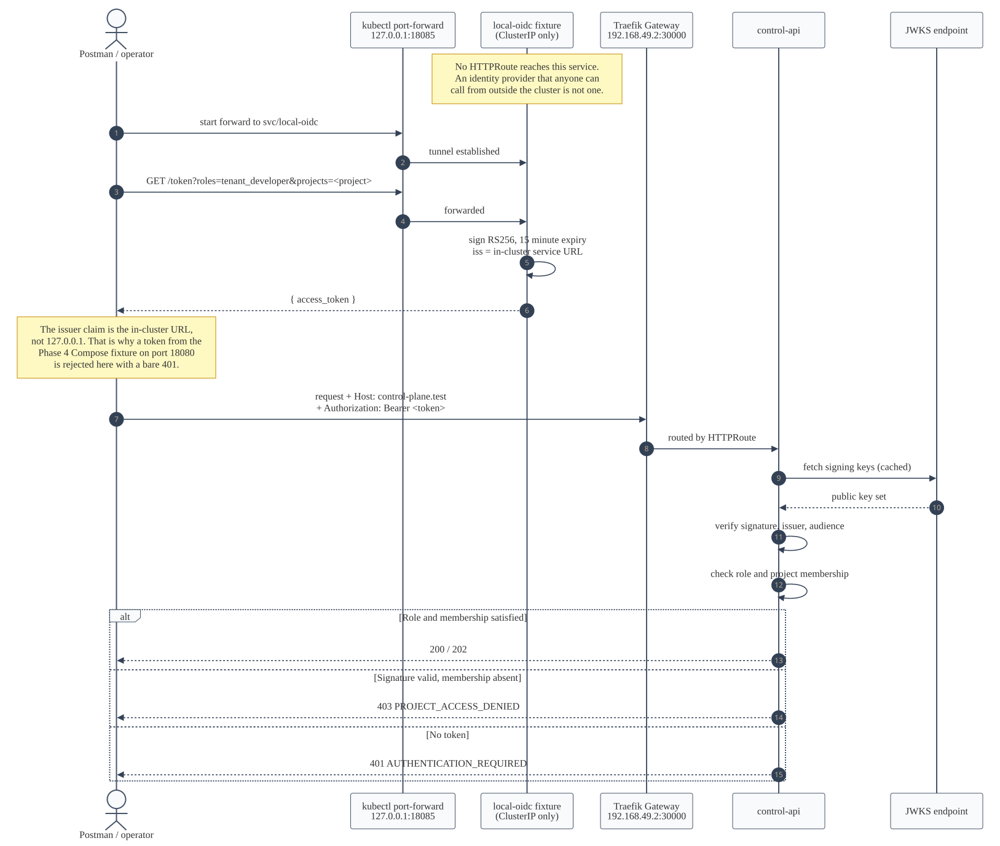

# Phase 6 Operations Manual

Everything needed to build, deploy, exercise, and tear down the control plane on the local
minikube cluster — as commands, in the order they are run.

This is the *how*. The *why* is in
[Phase 6 — Kubernetes Deployment and the GitOps Control Loop](../architecture/phase-6-gitops-deployment.md),
the failure paths are in the [Phase 6 Deployment Runbook](../runbooks/phase-6-deployment.md), and the
objects themselves are catalogued in the
[Phase 6 Manifest Reference](phase-6-manifest-reference.md).



## The shape of it

One step is imperative, everything else is declarative.

Argo CD reconciles *manifests*. It cannot reconcile a container image, because an image is not a
Kubernetes object — so building images is the one thing a person does directly, and
`pnpm run k8s:build-images` is where that lives. After that, the only way to change the cluster is
to change `deploy/kubernetes` and publish it; changing the cluster by hand is reverted within
seconds by self-healing, which is the point.

| Step | Command | Declarative? |
| --- | --- | --- |
| Build images | `pnpm run k8s:build-images` | No — the one exception |
| Install the controllers | `pnpm run k8s:bootstrap` | Applied once from pinned manifests |
| Publish manifests | `pnpm run k8s:publish` | Yes — this is the `git push` |
| Everything after that | — | Argo CD, continuously |

## Prerequisites

| Requirement | Checked with | Notes |
| --- | --- | --- |
| minikube running | `minikube status` | Docker driver; this deployment assumes a single node |
| `kubectl` | `kubectl version` | Context `minikube`; override with `PHASE6_KUBE_CONTEXT` |
| Argo Rollouts plugin | `kubectl argo rollouts version` | Optional for deploying, needed for `restart` and `retry` |
| Node.js and pnpm | `pnpm -v` | The tools are plain Node scripts, no extra dependencies |
| A Gateway with an HTTP listener | `kubectl get gateway -A` | **Pre-existing cluster foundation.** This phase attaches an `HTTPRoute` to it and modifies nothing about it |
| A default storage class | `kubectl get storageclass` | Consumed by PostgreSQL and Kafka |

The Gateway, the ingress controller, the storage class, and the Prometheus stack are the cluster
foundation. Phase 6 consumes them and never edits them.

## Bringing it up on a fresh cluster

```bash
# 1. The cluster itself.
minikube start

# 2. Build every image into the node's own Docker daemon.
#    Nothing is pushed anywhere; see "Why images are built inside the node" below.
pnpm run k8s:build-images

# 3. Install Argo CD, Argo Rollouts, the in-cluster Git repository, the AppProject,
#    and the root Application. Idempotent, and refuses to overwrite a controller
#    install it did not create.
pnpm run k8s:bootstrap

# 4. Publish deploy/kubernetes into the in-cluster repository and sync every Application.
pnpm run k8s:publish
```

Then wait for the waves to settle:

```bash
kubectl get applications -n argocd -w
```

The deployment is up when all ten Applications report `Synced` and `Healthy`:

```console
$ kubectl get applications -n argocd \
    -o custom-columns='NAME:.metadata.name,SYNC:.status.sync.status,HEALTH:.status.health.status'
NAME                          SYNC     HEALTH
control-plane-applications    Synced   Healthy
control-plane-dashboards      Synced   Healthy
control-plane-data            Synced   Healthy
control-plane-foundation      Synced   Healthy
control-plane-observability   Synced   Healthy
control-plane-platform        Synced   Healthy
control-plane-root            Synced   Healthy
platform-cloudnative-pg       Synced   Healthy
platform-keda                 Synced   Healthy
platform-strimzi              Synced   Healthy
```

First bring-up takes several minutes: the operators install their CRDs before wave 2 can create a
`Cluster` or a `Kafka`, PostgreSQL initialises a volume, and Kafka forms a KRaft quorum before the
migration Job can run.

## Bringing it up again after a stop

`minikube stop` preserves everything — volumes, images, and every object. Restarting is just:

```bash
minikube start
```

Argo CD, the operators, and the workloads come back on their own. Expect a few minutes of
`Progressing`, `Degraded`, and `CrashLoopBackOff` while PostgreSQL replays WAL and services retry
their database and broker connections; none of it needs intervention. Wait for it rather than
acting on it:

```bash
# Settled when this prints 0.
kubectl get pods -n private-cloud --no-headers \
  | awk '{split($2,a,"/"); if (a[1] != a[2]) c++} END {print c+0}'
```

If an Application is still not `Healthy` after everything is running, force a re-read:

```bash
pnpm run k8s:resync -- --wait
```

## Why images are built inside the node

There is no registry in this environment, and every workload declares
`imagePullPolicy: IfNotPresent`. A pod can therefore only start from an image *the node already
holds*. `pnpm run k8s:build-images` resolves `minikube docker-env` and builds straight into the
node's Docker daemon, so the layers are written once, in the only place they are needed.

Building on the host instead produces images the node cannot see, and `minikube image load`
re-exports and re-imports every layer — minutes per image, against a node disk that cannot hold
both copies.



```bash
# Everything, at the tag the manifests reference.
pnpm run k8s:build-images

# One or a few.
pnpm run k8s:build-images -- --only=control-api,provisioning-orchestrator

# A second tag, for a blue-green drill against a different revision.
pnpm run k8s:build-images -- --tag=phase6-green

# What would be built, from which Dockerfile, and which manifest consumes it.
pnpm run k8s:build-images -- --list

# The host daemon instead of the node — for the Compose stack, not for Kubernetes.
pnpm run k8s:build-images -- --host
```

Confirm what the node holds:

```bash
minikube image ls | grep private-cloud
```

The equivalent raw commands, if the tool is unavailable:

```bash
eval "$(minikube docker-env)"

docker build --file tools/docker/service.Dockerfile --target runtime \
  --build-arg APP=control-api --tag private-cloud/control-api:phase6 .

docker build --file tools/docker/service.Dockerfile --target local-runtime \
  --build-arg APP=control-api --tag private-cloud/local-runner:phase6 .

docker build --file tools/docker/kafka-connect.Dockerfile \
  --tag private-cloud/kafka-connect:phase6 .

docker build --file tools/docker/gitops-repo.Dockerfile \
  --tag private-cloud/gitops-repo:phase6 .
```

### Images and what uses them

| Image | Dockerfile and target | Consumed by |
| --- | --- | --- |
| `private-cloud/control-api:phase6` | `service.Dockerfile`, `runtime`, `APP=control-api` | `Rollout/control-api` |
| `private-cloud/provisioning-orchestrator:phase6` | `service.Dockerfile`, `runtime` | `Rollout/provisioning-orchestrator` |
| `private-cloud/proxmox-provider:phase6` | `service.Dockerfile`, `runtime` | `Rollout/proxmox-provider` |
| `private-cloud/reconciler:phase6` | `service.Dockerfile`, `runtime` | `Rollout/reconciler` |
| `private-cloud/local-runner:phase6` | `service.Dockerfile`, `local-runtime` | `Deployment/local-oidc`, `Job/schema-migrations` |
| `private-cloud/kafka-connect:phase6` | `kafka-connect.Dockerfile` | `KafkaConnect/control-plane-connect` |
| `private-cloud/gitops-repo:phase6` | `gitops-repo.Dockerfile` | `Deployment/gitops-repo` |

`local-runner` is the same build stopped at a later stage: it adds the OIDC fixture, the Proxmox
simulator, and the migration tooling. No production service image contains any of them.

## Deploying a code change

Rebuilding an image under the tag the manifests already name does not restart anything — the
manifest has not changed, so Argo CD has nothing to reconcile and Kubernetes has no reason to
replace a running pod.

**For local iteration**, rebuild and restart the rollout:

```bash
pnpm run k8s:build-images -- --only=control-api
kubectl argo rollouts restart control-api -n private-cloud
```

This replaces the pods in place. It does not create a new rollout revision, so no promotion and no
analysis run — which is what you want while iterating, and not what you want for anything else.

**For a real release**, give the image a new tag, point the manifest at it, and publish. That
produces a genuine revision, a green environment, and a gated promotion:

```bash
pnpm run k8s:build-images -- --tag=phase6-green --only=control-api
# edit deploy/kubernetes/applications/control-api.yaml to reference :phase6-green
pnpm run k8s:render-check
pnpm run k8s:publish
kubectl argo rollouts get rollout control-api -n private-cloud --watch
```

## Deploying a manifest change

```bash
# 1. Render every kustomize root, dry-run it against the API server, and apply the
#    deployment policies. Catches most mistakes without touching the cluster.
pnpm run k8s:render-check

# 2. Publish. Packs deploy/kubernetes into a ConfigMap, rolls the repository server,
#    waits until the repository proves it is serving this exact publish, then
#    hard-refreshes and syncs every Application.
pnpm run k8s:publish

# Publish without telling Argo CD, leaving it to its own poll interval.
pnpm run k8s:publish -- --no-refresh
```

`k8s:publish` deliberately reads back a digest marker committed into the repository before
notifying Argo CD. Argo CD refuses to re-attempt a revision it has already attempted, so a refresh
issued while the old commit was still being served would strand the new one behind a self-heal
backoff of up to five minutes.

## Reaching the API from the host

The Gateway is a `LoadBalancer` Service exposed on a node port. Two values identify it:

```bash
minikube ip                                   # 192.168.49.2
kubectl get svc -n traefik traefik            # 80:30000/TCP
```

The `HTTPRoute` matches on hostname, so requests carry `Host: control-plane.test`. Sending the
header avoids needing an `/etc/hosts` entry:

```bash
GATEWAY="http://$(minikube ip):30000"

curl -s -H 'Host: control-plane.test' "$GATEWAY/health/live"
# {"service":"control-api","status":"ok"}
```

To reach the **green** environment instead of the active one, add the canary header:

```bash
curl -s -H 'Host: control-plane.test' -H 'X-Canary: green' "$GATEWAY/health/live"
```

If you would rather use the hostname directly, add it to `/etc/hosts` once and drop the header:

```bash
echo "$(minikube ip) control-plane.test" | sudo tee -a /etc/hosts
curl -s http://control-plane.test:30000/health/live
```

## Getting a JWT

Every `/v1/**` endpoint requires a bearer token. The issuer is an in-cluster fixture with no route
through the Gateway — deliberately, since an identity provider reachable from outside the cluster
is not one — so it is reached over a port-forward.



```bash
# Keep this running in a second terminal.
kubectl port-forward -n private-cloud svc/local-oidc 18085:18080
```

```bash
PROJECT=00000000-0000-4000-8000-000000000001

TENANT=$(curl -s "http://127.0.0.1:18085/token?roles=tenant_developer&projects=$PROJECT" \
  | node -pe 'JSON.parse(require("fs").readFileSync(0,"utf8")).access_token')

ADMIN=$(curl -s "http://127.0.0.1:18085/token?roles=platform_administrator&projects=$PROJECT" \
  | node -pe 'JSON.parse(require("fs").readFileSync(0,"utf8")).access_token')

curl -s -H 'Host: control-plane.test' -H "Authorization: Bearer $TENANT" \
  "$GATEWAY/v1/projects/$PROJECT/quota"
```

**Use port 18085, not 18080.** The Phase 4 Compose stack binds 18080 on the host, and a
port-forward that loses that race fails silently — `kubectl` reports the bind failure while `curl`
happily talks to the Compose fixture instead. That fixture signs a token with a *different* `iss`
claim, which the cluster rejects with a bare `401 AUTHENTICATION_REQUIRED` and no hint as to why.

Tokens live 15 minutes. Re-run the request rather than debugging a sudden 401.

| Query parameter | Default | Purpose |
| --- | --- | --- |
| `roles` | `tenant_developer` | Comma-separated. `tenant_developer` for `/v1/projects/**`, `platform_administrator` for `/v1/admin/**` |
| `projects` | the seeded project | Comma-separated project UUIDs the token grants membership of |
| `subject` | `phase4-local-user` | Becomes the `sub` claim and the audit actor |

The two roles are not interchangeable in either direction: administrative recovery is never
inferred from project membership, and a `tenant_developer` token gets `403 ADMIN_REQUIRED` on the
admin surface.

## Verifying

Three layers, cheapest first.

```bash
# Static: renders 9 kustomize roots, dry-runs them against the API server,
# and applies 8 deployment policies. No cluster changes.
pnpm run k8s:render-check

# Deployment behaviour: 12 checks including live blue-green drills — a healthy
# promotion, an aborted one, a progress-deadline abort, and manual drift being
# reverted. Takes roughly 30 minutes with drills.
pnpm run verify:phase6-runtime
pnpm run verify:phase6-runtime -- --skip-drills   # observation only, a few minutes
pnpm run verify:phase6-runtime -- --only=header-routing

# API behaviour: 62 requests through the Gateway covering the whole lifecycle.
# Manages its own port-forward.
pnpm run postman:run
pnpm run postman:run -- --folder=03
```

Evidence is written to `docs/verification/evidence/phase6-runtime.json` and
`docs/verification/evidence/phase6-api-examples.json`.

The full repository gate, which includes all of the above except the runtime drills:

```bash
pnpm run contracts:validate
pnpm run docs:validate
pnpm run format:check
pnpm run lint
pnpm run typecheck
pnpm run test
pnpm run test:integration
pnpm run build
pnpm run k8s:render-check
pnpm run postman:check
```

## Inspecting a running deployment

```bash
# Applications and their sync state.
kubectl get applications -n argocd

# Rollouts, their revisions, and which environment is active.
kubectl argo rollouts list rollouts -n private-cloud
kubectl argo rollouts get rollout control-api -n private-cloud

# Which ReplicaSet each Service currently selects. This single field is the promotion.
kubectl get svc control-api control-api-preview -n private-cloud \
  -o custom-columns='NAME:.metadata.name,SELECTS:.spec.selector.rollouts-pod-template-hash'

# Analysis runs and the metric that decided each one.
kubectl get analysisruns -n private-cloud
kubectl get analysisrun <name> -n private-cloud \
  -o jsonpath='{range .status.metricResults[*]}{.name}{"\t"}{.phase}{"\t"}{.message}{"\n"}{end}'

# The database, by name from the operator-generated secret.
DB=$(kubectl get secret -n private-cloud control-plane-postgres-app \
  -o jsonpath='{.data.dbname}' | base64 -d)
kubectl exec -n private-cloud control-plane-postgres-1 -c postgres -- \
  psql -U postgres -d "$DB" -c 'SELECT action, stage, status FROM workflow.workflows ORDER BY created_at DESC LIMIT 10;'

# Kafka topics and the change-data-capture connector.
kubectl get kafkatopics -n private-cloud
kubectl get kafkaconnector -n private-cloud -o wide
```

## Bringing it down

Three different things are meant by "down". Pick the one you actually want.

### Pause the cluster, keep everything

```bash
minikube stop
```

Volumes, images, and objects all persist. `minikube start` brings the whole deployment back with
no republish.

### Remove the control plane, keep the cluster

The declarative way is to stop describing it. Argo CD's `prune` deletes what the repository no
longer mentions:

```bash
# Delete the root Application; the finalizer cascades to the children and their objects.
kubectl delete application control-plane-root -n argocd

# Or remove individual applications and republish.
kubectl delete application control-plane-applications -n argocd
```

The `resources-finalizer.argocd.argoproj.io` finalizer on each Application makes the deletion
cascade to everything it created. Deleting the namespace directly instead leaves Argo CD trying to
recreate it, which looks like a stuck deletion and is really self-healing doing its job.

### Destroy everything

```bash
minikube delete
```

Removes the cluster, its volumes, and every image built into it. Bringing it back means the full
fresh-cluster sequence, including rebuilding all seven images.

### What is deliberately not here

There is no command that stops or deletes a *VM* as part of tearing down the deployment. Instance
lifecycle is an API concern with its own guards — soft deletion retains the resource, and only an
explicit administrative purge destroys it after its retention window. Removing the control plane
leaves whatever it provisioned exactly where it is.

## Common problems

| Symptom | Cause | Action |
| --- | --- | --- |
| `401 AUTHENTICATION_REQUIRED` with a fresh token | Port-forward lost the bind race with the Compose stack on 18080 | Use 18085; check `kubectl port-forward` output for `address already in use` |
| `404 page not found` from the Gateway | `Host` header missing, so no `HTTPRoute` matched | Add `-H 'Host: control-plane.test'` |
| `minikube docker-env` prints `false exit code 83` | The cluster is stopped | `minikube start` |
| An Application stays `OutOfSync` | A controller writes a field the repository does not declare | Add it to `ignoreDifferences`; see the runbook |
| An operation stays `accepted` forever | The orchestrator cannot claim or execute the workflow | `kubectl logs -n private-cloud -l app.kubernetes.io/name=provisioning-orchestrator` |
| A publish appears to be ignored | Argo CD already attempted that revision | `pnpm run k8s:resync -- --wait` |

Deeper failure handling — stuck rollouts, aborted promotions, non-converging applications, manual
drift — is in the [Phase 6 Deployment Runbook](../runbooks/phase-6-deployment.md).

## Related documents

- [Phase 6 API Examples](phase-6-api-examples.md) — every request and its measured response
- [Phase 6 Postman Collection](phase-6-postman-collection.md) — importing and running it
- [Phase 6 Manifest Reference](phase-6-manifest-reference.md) — every object, and why it exists
- [Phase 6 GitOps Deployment](../architecture/phase-6-gitops-deployment.md) — the design
- [Phase 6 Deployment Runbook](../runbooks/phase-6-deployment.md) — when it goes wrong
- [Phase 6 Cluster Verification](../verification/phase-6-cluster-verification.md) — recorded results
