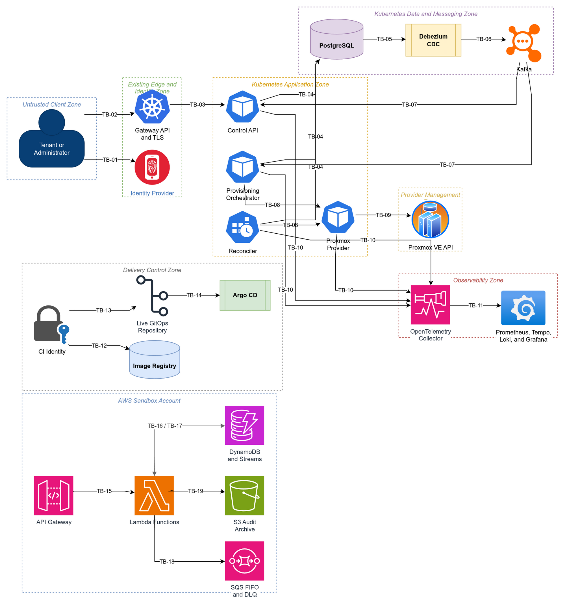

# Trust Boundaries

## Purpose

This document identifies every boundary where identity, authority, data format, or operational ownership changes. Crossing a boundary always requires explicit authentication where applicable, authorization, input validation, bounded timeouts, and telemetry that does not disclose secrets.

The diagrams describe logical trust zones. Network placement alone does not establish trust.

## Boundary Diagram

[Open the editable Draw.io source](../diagrams/src/trust-boundaries.drawio).

## Boundary Register

| ID | Crossing | Trust change | Required controls | Evidence |
| --- | --- | --- | --- | --- |
| TB-01 | User to identity provider | An untrusted identity requests authentication | Identity-provider policy, strong administrator authentication, short-lived signed tokens | Authentication configuration and negative tests |
| TB-02 | User to Gateway API | Internet traffic enters the existing cluster edge | Trusted TLS path, request-size and rate limits, bounded headers, connection timeout | Gateway policy and external endpoint test |
| TB-03 | Gateway to Control API | An identity assertion becomes application authority | Token signature, issuer, audience, expiry, and role validation; project authorization on every resource | Authorization matrix and cross-project tests |
| TB-04 | Application to PostgreSQL | A workload may read or mutate durable control-plane state | Per-deployable database roles, TLS where supported, schema grants, parameterized access, transaction isolation, connection limits | Role/grant audit and integration tests |
| TB-05 | PostgreSQL WAL to Debezium | Committed database changes become replication input | Dedicated replication identity, restricted publication/table scope, encrypted secret reference, monitored replication slot | Connector configuration and outbox outage test |
| TB-06 | Debezium to Kafka | Database records become transport messages | Topic allowlist, producer authentication and authorization, envelope validation, no secret-bearing columns | Topic ACL audit and contract tests |
| TB-07 | Kafka to application consumers | At-least-once untrusted transport input reaches domain handlers | Consumer authentication, topic ACLs, schema/version validation, payload limits, inbox deduplication, partition-key checks | Duplicate, poison-message, and unsupported-version tests |
| TB-08 | Orchestrator or Reconciler to provider service | Domain intent becomes provider-capable RPC | Workload identity, method authorization, strict provider-neutral contracts, deadlines, concurrency limits, caller attribution | gRPC contract and authorization tests |
| TB-09 | Provider service to Proxmox | The system crosses into the hypervisor management plane | Dedicated least-privilege credential, trusted certificate, endpoint and allowlist pinning, ownership markers, provider-side timeout | Activation record and live canary evidence |
| TB-10 | Workload to OpenTelemetry Collector | Potentially sensitive execution context becomes telemetry | Redaction processors, bounded attributes, authenticated or network-restricted intake, fail-open application exporters | Redaction tests and collector-outage drill |
| TB-11 | Collector to observability backends | Telemetry becomes retained and queryable | Namespace isolation, retention policy, query access control, no secret labels or bodies | Access review, retention configuration, query checks |
| TB-12 | CI to image registry | Build output becomes executable supply-chain input | Short-lived CI identity, signed provenance, vulnerability policy, immutable digest | Attestation and digest verification |
| TB-13 | CI to live GitOps repository | Application release intent becomes runtime desired state | Short-lived identity, protected branch, required review, digest-only image update | Pull-request and branch-policy evidence |
| TB-14 | Live repository to Argo CD | Reviewed desired state becomes cluster mutation | Read-only repository credential, scoped Argo project, sync policy, diff and health verification | Argo application policy and sync record |
| TB-15 | Internet to API Gateway and Lambda | Public AWS traffic invokes command acceptance | TLS, authorizer, throttling, request validation, payload limits, execution timeout | Gateway tests and CloudWatch evidence |
| TB-16 | Lambda to DynamoDB | Function authority mutates AWS command state | Dedicated IAM role, table/index ARN scope, transactional writes, condition expressions, encryption | IAM policy validation and transaction tests |
| TB-17 | DynamoDB Streams to relay Lambda | At-least-once change records invoke code | Event-source filtering, stable event identity, partial batch response, bounded retry and concurrency | Duplicate and partial-batch tests |
| TB-18 | Relay Lambda to SQS | Durable outbox records become ordered commands | Queue-scoped IAM, FIFO group and deduplication IDs, encryption, redrive policy | Queue policy and duplicate-publication tests |
| TB-19 | Lambda to S3 audit archive | Audit data crosses into long-term storage | Bucket-scoped IAM, block public access, encryption, retention and lifecycle policy, integrity metadata | Bucket-policy and lifecycle checks |

## Identity and Authority Rules

1. A network source, Kubernetes namespace, service name, or Kafka consumer group is not sufficient proof of authority.
2. Tenant authorization is always evaluated against the project in durable state, never solely against a caller-supplied project field.
3. Only the Proxmox Provider holds a provider credential. The Control API, Orchestrator, and Reconciler cannot call Proxmox directly.
4. The provider credential grants VM operations within the lab need; it grants no host, cluster, storage, SDN, or identity administration.
5. Each Kubernetes deployable and AWS Lambda function receives a distinct workload identity and least-privilege data-plane permissions.
6. CI and hybrid access use short-lived identity. Static AWS access keys and credentials in repository history are prohibited.
7. Administrative purge, dead-letter replay, provider-profile activation, and retention-policy changes require an administrator identity and retained audit reason.

## Network Policy Intent

| Workload | Allowed egress | Explicitly denied by default |
| --- | --- | --- |
| Control API | PostgreSQL, Kafka as a projection consumer, identity discovery or key endpoint, OpenTelemetry Collector | Proxmox, Kubernetes API, public internet except declared identity dependency |
| Provisioning Orchestrator | PostgreSQL, Kafka, Proxmox Provider, OpenTelemetry Collector | Proxmox directly, Kubernetes API, public internet |
| Proxmox Provider | Proxmox API, OpenTelemetry Collector, required secret delivery endpoint | PostgreSQL, Kafka, Kubernetes API, unrelated management networks |
| Reconciler | PostgreSQL, Kafka where event publication requires it, Proxmox Provider, OpenTelemetry Collector | Proxmox directly, public internet |
| Debezium | PostgreSQL replication endpoint, Kafka | Application APIs, Proxmox, public internet |
| Application workloads | Cluster DNS and explicitly listed dependencies | Namespace-wide and internet-wide unrestricted egress |

Concrete NetworkPolicies belong in `private-cloud-platform-live`; this repository owns the required connectivity contract and verification cases.

## Failure Posture

- Identity, authorization, catalog, ownership, and destructive-operation checks fail closed.
- Telemetry export fails open for application work and produces bounded local diagnostics.
- Kafka unavailability does not roll back a committed acceptance transaction; the outbox retains work.
- Provider timeout produces an unknown outcome, not an automatic duplicate mutation.
- An unavailable revocation or authorization dependency prevents new privileged actions rather than reusing stale administrative authority indefinitely.

## Requirement Links

- Functional: `SRS-FR-001` through `SRS-FR-005`, `SRS-FR-011` through `SRS-FR-017`, `SRS-FR-054` through `SRS-FR-067`, and `SRS-FR-075` through `SRS-FR-091`
- Non-functional: `SRS-NFR-011`, `SRS-NFR-014` through `SRS-NFR-025`, and `SRS-NFR-032` through `SRS-NFR-036`
- Safety: `SAFE-001` through `SAFE-007`, `SAFE-031` through `SAFE-036`
