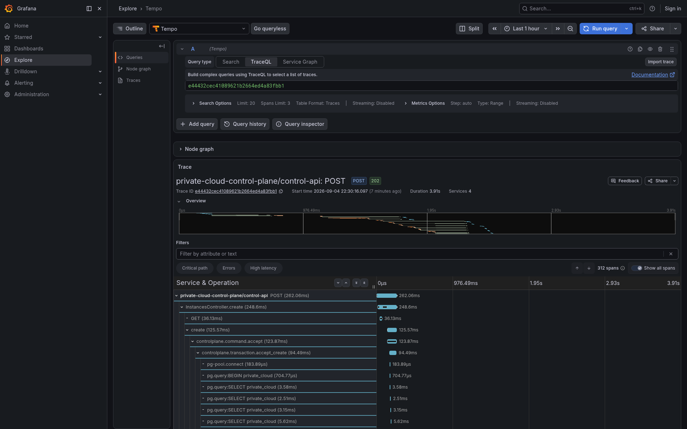
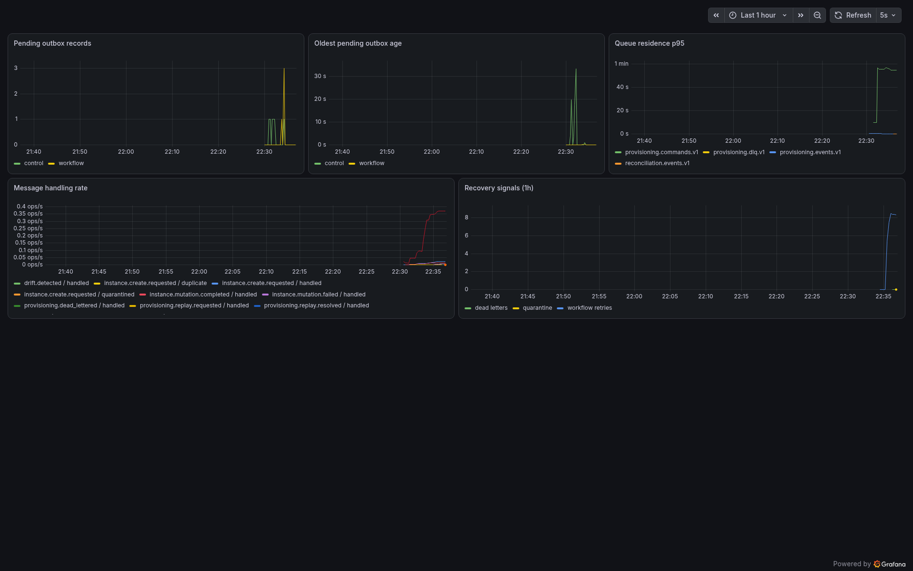

# Phase 4 Local Verification

- Execution date: 2026-09-04 Africa/Cairo
- Runtime: Node.js 24.18.0, pnpm 11.3.0, Docker 29.7.2, and Compose 5.5.0
- Dependencies: PostgreSQL 16.10, Apache Kafka 4.1.2 in KRaft mode, Debezium Connect 3.4.3,
  OpenTelemetry Collector Contrib 0.158.0, Tempo 2.10.7, Prometheus 3.12.0, and Grafana 13.1.0
- Provider: Proxmox adapter over gRPC to a local TLS Proxmox-compatible HTTP simulator; no live
  hypervisor was contacted or mutated
- Evidence status: `passed`
- End-to-end duration: 625.7 seconds from clean named volumes, including the production image build

The authoritative gate is:

```bash
pnpm run verify:phase4-runtime -- --reset
```

It writes bounded machine-readable evidence to
[`evidence/phase4-runtime.json`](evidence/phase4-runtime.json), captures browser screenshots, and
leaves the persistent Compose stack running for inspection.

## Runtime Results

| Drill | Measured result |
| --- | --- |
| Proxmox-adapter happy path | REST returned `202`; one command receipt, workflow, projection, provider resource, and terminal success were observed; duplicate business effects remained zero |
| Kafka outage | The API returned `202` while Kafka was stopped and no receipt existed; after broker and Connect recovery the original durable intent completed |
| Consumer outage | Kafka retained the command while the Orchestrator was stopped; the same delivery completed after consumer recovery |
| Checkpoint restart | The workflow was stopped at `polling_create`, resumed at `completed`, and retained the same provider resource |
| Retryable provider failure | One persisted retry wait occurred before successful forward progress |
| Permanent provider failure | The operation terminated as `failed` with zero dead letters |
| Ambiguous provider mutation | The operation terminated as `manual_review`; no automatic second mutation was attempted |
| Retry exhaustion | The safely replayable workflow exhausted at exactly eight attempts and entered governed dead-letter recovery |
| Replay authorization | A denied replay returned HTTP `403`; an authorized replay admitted generation one while retaining the original logical event ID |
| Replay tracing | The new administrative trace contained one link to the original failed trace rather than using it as a parent |
| Authorized replay delivery | The generation-one command receipt carried real broker coordinates on `provisioning.commands.v1`; the durable authorization reached `completed` with its `authorized_outbox_id` matching the published outbox row; the broker record itself carried `replay-generation: 1`, the authorized outbox identity, and the preserved W3C carrier |
| Unauthorized replay command | A delivery for a generation with no matching authorization was quarantined as `REPLAY_COMMAND_UNAUTHORIZED` without consuming the live authorization or reopening a workflow |
| Conflicting replay identity | A different payload under an already-received generation was quarantined as `REPLAY_COMMAND_IDENTITY_CONFLICT`, proving the two rejection causes are now distinguishable |
| Duplicate replay request | Repeating the request under the same idempotency key replayed the stored response and created no second authorization |
| Outbox drain | Both owner outboxes returned to zero unconsumed records, and the exported gauge agreed with the database |
| Poison delivery | One quarantine record was added and raw payload storage remained false |
| Restricted telemetry | Prohibited metric-label count, restricted metric values, and restricted trace values were all zero |

The recovery sequence proves two distinct duplicate boundaries. A normal broker redelivery reuses
generation zero and cannot repeat a provider effect. Governed replay preserves the logical event ID
but allocates generation one in the authoritative replay transaction. The replay-admitted original
receipt has no fabricated Kafka coordinates.

The replay drills are deliberately asymmetric, because admission deduplicates on
`(event_id, replay_generation)` and the payload hash **before** it consults durable authority. A
byte-identical redelivery of an already-received generation is therefore a duplicate and never
reaches the authority check — which is correct, and is why the unauthorized-replay drill uses a
generation with no receipt yet, while the identity-conflict drill mutates the payload under a
generation that already has one.

Transactional audit publication was also verified with `pnpm run verify:audit-topology`: two Control
API and three Orchestrator audit facts matched their relational audit entries and reached
`audit.events.v1` with project keys, contract headers, W3C context, and generation zero.

## Trace Evidence

The known happy-path trace contained 290 spans across four services, including 14 Proxmox HTTP
client spans. The asserted span surface was:

| Layer | Required span evidence |
| --- | --- |
| Control API | `InstancesController.create`, `controlplane.command.accept`, `controlplane.transaction.accept_create`, `controlplane.outbox.write` |
| PostgreSQL and CDC | PostgreSQL client spans, `db-log-write`, `private-cloud-outbox-relay` |
| Kafka and admission | `provisioning.commands.v1 process`, `controlplane.transaction.command_admission` |
| Workflow and provider | `controlplane.workflow.stage`, provider gRPC, `controlplane.provider.adapter`, 14 allowlisted Proxmox HTTP spans |
| Projection | `provisioning.events.v1 process`, `controlplane.projection.apply` |

Persisted W3C context allowed the replacement worker to continue the same trace after checkpoint
restart without holding a span open while waiting. The replay drill independently proved the linked
administrative trace.



The inspected 1920x1200 browser capture shows a 3.42-second trace with 290 spans across four services,
rooted at the Control API `202 Accepted` request.

## Metric Evidence

Prometheus reported exactly one healthy scrape target, the Collector's consolidated endpoint. The
gate required all 23 application and infrastructure metric families:

| Category | Required samples |
| --- | --- |
| Command and messaging | accepted commands, processed messages, queue residence, outbox publish delay |
| Workflow and provider | transitions, retries, active work, oldest-ready age, provider-operation duration |
| Projection and recovery | projection duration, projection event age, dead letters, quarantine, replay |
| Kafka and Connect | broker messages-in, Connect task-running ratio, Debezium PostgreSQL connectivity |
| PostgreSQL | commits, database locks, logical-slot activity |
| Collector | accepted and refused metric points, exported spans |

Every `controlplane_*` series was confirmed to have
`instance="otel-collector:8889"`. Exact label-name checks and restricted fixture-value searches
returned zero findings. The [metric catalog](../observability/phase-4-metric-catalog.md) records the
types, units, attribute allowlists, and explicit histogram buckets.

Grafana provisioned Prometheus and Tempo data sources, an exemplar destination from Prometheus to
Tempo, and five panels: pending outbox records, oldest pending age, queue-residence p95, message
handling rate, and one-hour recovery signals.



## Container Evidence

The final persistent stack contained 13 running services. All 12 services with health checks were
healthy, Tempo was running, and all five initialization jobs exited successfully. The verifier then
waited a 10-second stability window and repeated the health checks to catch delayed failures.

The retained inspection endpoints are:

| Surface | URL |
| --- | --- |
| Control API | `http://127.0.0.1:3100` |
| Grafana | `http://127.0.0.1:3101` |
| Prometheus | `http://127.0.0.1:9090` |
| Tempo | `http://127.0.0.1:3200` |
| Kafka Connect | `http://127.0.0.1:8083` |

The Proxmox simulator's certificate and key are generated by an idempotent one-shot job into a named
volume. PostgreSQL migration and seed jobs use bounded startup retries only for transient connection
states. Connect's scheduled rebalance delay is bounded to five seconds for deterministic recovery.

## Static Evidence

The closing uncached Nx target matrix completed successfully across all 14 workspace projects and
executed 66 tests, plus three `node:test` cases for the database readiness helper that are now part
of `pnpm run test` rather than orphaned. The separately developed console's generated typecheck
target is disabled by its project configuration; every backend and shared-package typecheck ran
normally. Contract regeneration is stable and validates at 39 REST operations, 54 RPCs, 20 event
messages, and 895 field rows. All six migrations and the seed were idempotently reapplied.

The standalone audit-topology drill passed twice back-to-back against the populated persistent
database after its synthetic request identities, broker coordinates, and evidence queries were made
run-scoped. Each run proved two Control API facts, three Orchestrator facts, matching relational audit
IDs, generation-one replay, and null synthetic coordinates for the restored original receipt.

Compose rendering, Collector validation, `promtool`, JSON parsing, JavaScript syntax, scoped
Prettier, documentation validation for 49 Markdown files, exact rendering comparison for 28 Mermaid
sources, and staged diff checks passed. The production audit was inspected path by path: all current
advisories resolve exclusively through the separately developed console package, and none reach a
Phase 4 service or shared runtime package.

## Known Local Limitation

KafkaJS 2.2.4 on Node.js 24 can emit `TimeoutNegativeWarning` from its internal request queue during
broker recovery. The bounded outage and redelivery drill completed. This warning is a dependency
compatibility signal to reassess before choosing a production runtime; it is not hidden or suppressed.

This verification does not cover Kubernetes, KEDA, replicated Kafka, database failover, load or
saturation behavior, SLOs and alerts, long-term retention, centralized logs, telemetry-backend
outage, active reconciliation, or a real Proxmox mutation.
