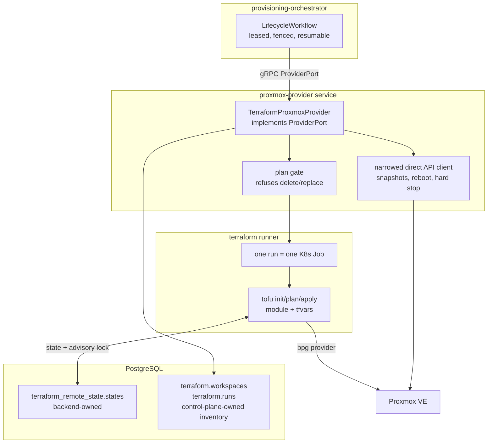

# Terraform-Backed Provisioning — Plan

Replacing the direct Proxmox API adapter with the `bpg/proxmox` Terraform provider, and adding a
first-class inventory of Terraform state.

**Status:** research and design only. Nothing in this plan has been implemented. It is written to
be executed against a **single standalone Proxmox test server** once one is available.

**Deferred.** Software-defined networking — VPCs, EVPN zones, VRFs, AZ-scoped subnets, public
addressing — is **out of scope here** and parked in
[Tenant VPC Topology](vpc-topology-plan.md), which is unscheduled and should not be started
alongside this work. This plan changes only _how_ the existing lifecycle workflow reaches Proxmox.
See §1.1.

**Measured against the real server.** The claims in §3, §6.3, §6.4 and §6.5 were verified by hand
before any code was written; see
[Terraform Manual Walkthrough](docs/architecture/terraform-manual-walkthrough.md). Where a
measurement contradicted this document, the correction is inline and attributed.

---

## 1. What is being asked, restated precisely

Today `packages/provider-adapters/src/proxmox-provider.ts` (1,459 lines) speaks HTTP directly to
`/api2/json`. It clones a template, POSTs config forms, polls UPIDs, and parses ownership markers
out of the VM description. It is the only file in the repository that can affect real hardware.

The ask is to change the execution mechanism underneath the provider port: instead of the adapter
issuing Proxmox API calls, it should render Terraform configuration and drive
`terraform`/`tofu`, with the resulting state files tracked as a queryable inventory.

Two things must **not** change, and the plan is built around them:

- **The provider port stays exactly as it is.** `ProviderPort` in `packages/provider-sdk` is
  provider-neutral by design and names no vendor. Terraform is an implementation detail of one
  adapter. `FakeProvider` and every workflow test keep working untouched.
- **Every safety invariant survives.** In particular SAFE-006 (purge needs database _and_ live
  ownership), SAFE-026 (disk grows, never shrinks), SAFE-028 (delete is soft), SAFE-029
  (reconciliation reports drift, never repairs destructively), and the standing rule that no
  failure branch may automatically stop, delete, or purge a VM.

Terraform makes the second point harder, not easier. That is the central risk in this plan and
section 6 is devoted to it.

### 1.1 Scope and non-goals

**In scope: the nine lifecycle capabilities that exist today, executed through Terraform instead
of through hand-written HTTP calls.** Create, observed status, power, CPU and memory resize, disk
growth, snapshots, soft deletion, administrative purge, reconciliation. The REST and gRPC
contracts, the event schemas, the workflow stages, the lease and fencing model, and the
authorization rules are all unchanged. A caller cannot tell which adapter served their request.

**Explicitly deferred, and not to be designed into this work:**

| Deferred                                                 | Where it goes                               |
| -------------------------------------------------------- | ------------------------------------------- |
| VPCs, EVPN zones, VRFs, overlapping tenant address space | [Tenant VPC Topology](vpc-topology-plan.md) |
| Tenant-managed subnets, VNets, VNIs, anycast gateways    | same                                        |
| Availability zones and placement across failure domains  | same                                        |
| Public addressing, exit nodes, SNAT                      | same                                        |
| Cluster-wide SDN apply and its global writer             | same                                        |
| HA groups, live migration, cross-node replication        | same                                        |

Networking stays exactly what it is today: one allowlisted bridge and one address pool that a
platform operator seeds into `control.networks`, with `allocateIpv4` leasing out of it. The
module takes a bridge name and an address; it does not create networks.

This matters for more than scope discipline. The SDN work introduces an operation whose blast
radius is an entire cluster rather than one VM, and it needs a Terraform runner that has already
been proven against real hardware. Building both at once would mean debugging a new execution
engine and a new class of outage at the same time.

### 1.2 The test environment is one standalone node

Verification runs against **a single Proxmox server, not a cluster.** That is a simplification,
and the plan leans on it deliberately:

- **`node_name` is a single fixed value.** No placement, no node selection, no `/cluster/nextid`.
  The module sets `migrate = false`, so a node change would be a replacement — and §6.1's gate
  refuses replacements, which is the behaviour we want.
- **No shared storage, no HA, no migration.** One storage id, allowlisted.
- **Cluster-scoped resources are not used at all.** No `proxmox_virtual_environment_cluster_*`,
  no SDN resources, no HA resources. The API token can therefore be scoped to a single pool.
- **Concurrency still gets tested properly.** Per-instance workspace locking (§4.2) is a property
  of PostgreSQL, not of Proxmox, so the containerized layer exercises it fully without a cluster.

Nothing in the design assumes a single node in a way that would have to be unpicked later — a
cluster would add node selection above this layer, not change the per-instance model beneath it.

---

## 2. Provider choice: `bpg/proxmox`

Your read is correct, and the release history is the clearest evidence:

|                   | `bpg/proxmox`                      | `Telmate/proxmox`                                                                                  |
| ----------------- | ---------------------------------- | -------------------------------------------------------------------------------------------------- |
| License           | MPL-2.0                            | MIT                                                                                                |
| Latest release    | `v0.112.0`, 2026-09-04             | `v3.0.2-rc10`, 2026-08-30                                                                          |
| Release character | Stable minors, roughly monthly     | Release candidates only — `v3.0.2-rc05` through `rc10` span Oct 2025 → Aug 2026 with no stable cut |
| Resources         | ~115 resources, ~90 data sources   | A handful, centred on `proxmox_vm_qemu`                                                            |
| Framework         | Terraform Plugin Framework + SDKv2 | SDKv2                                                                                              |

Telmate has been in an unbroken release-candidate series for close to a year. For the one file in
this repository that can affect real hardware, "the maintainers have not been willing to call it
stable" is disqualifying on its own.

**Decision: `bpg/proxmox`, pinned to an exact version with a committed `.terraform.lock.hcl`.**

### Cloud-init on bpg — and the trap in it

bpg exposes cloud-init through the `initialization` block on
`proxmox_virtual_environment_vm`. It splits cleanly into two halves, and the split matters more
than anything else in the provider:

**In-place updatable** (verified against `proxmoxtf/resource/vm/vm.go` — no `ForceNew`):

- `initialization.ip_config.ipv4.address` / `.gateway` — what `ipconfig0` is today
- `initialization.user_account.username`, `.password`, `.keys` — SSH keys and the cloud user
- `initialization.dns.servers`, `.domain`
- `initialization.upgrade`

**ForceNew — changing any of these destroys and recreates the VM:**

- `initialization.user_data_file_id`
- `initialization.vendor_data_file_id`
- `initialization.network_data_file_id`
- `initialization.meta_data_file_id`
- `initialization.type`

That is the trap. The snippet-file form of cloud-init is the powerful one — arbitrary user-data —
and it is exactly the form where editing the cloud-init config asks Terraform to delete a running
customer VM and build a new one. Under SAFE-028 and the no-destructive-compensation rule, that
plan must never be applied.

There is a second cost to the snippet form: uploading a snippet through
`proxmox_virtual_environment_file` **requires SSH access to the Proxmox node**, not just an API
token ("The resource with this content type uses SSH access to the node"), and `file_mode` is
`root@pam`-only. The current adapter needs no SSH at all.

**Decision: use inline cloud-init only.** `ip_config`, `user_account`, and `dns` cover everything
the control plane sends today — `ipconfig0`, `nameserver`, `sshkeys`, hostname — with no SSH
dependency and with in-place updates. Snippet-based user-data is deliberately out of scope; if it
is ever wanted, it needs its own design that treats a user-data change as create-a-new-instance,
never as an update.

---

## 3. What Terraform can and cannot do here

This is the part that determines the shape of the work. `ProviderPort` declares 17 methods.
Terraform is a desired-state engine; several of these methods are inherently imperative and have
no Terraform expression at all. bpg publishes **no snapshot resource and no snapshot data
source** — snapshots are simply not in the provider.

| #   | Port method                  | Route         | Notes                                                                                                           |
| --- | ---------------------------- | ------------- | --------------------------------------------------------------------------------------------------------------- |
| 1   | `validateProfile`            | Hybrid        | `terraform init` + `validate` + read-only data sources (`virtual_environment_version`, `_nodes`, `_datastores`) |
| 2   | `getCapabilities`            | Local         | Static declaration; no I/O                                                                                      |
| 3   | `submitCreateInstance`       | **Terraform** | Render tfvars, `apply`                                                                                          |
| 4   | `applyInstanceConfiguration` | **Terraform** | Becomes a _convergence check_ — see §5.3                                                                        |
| 5   | `getTask`                    | **Terraform** | Poll the run record, not a UPID                                                                                 |
| 6   | `observeInstance`            | **Terraform** | `plan -refresh-only -json` — richer than today                                                                  |
| 7   | `startInstance`              | **Terraform** | `started = true`                                                                                                |
| 8   | `shutdownInstance`           | **Terraform** | `started = false` (graceful)                                                                                    |
| 9   | `stopInstance`               | Direct API    | A _hard_ stop is not expressible; `started=false` is graceful                                                   |
| 10  | `rebootInstance`             | Direct API    | No declarative expression of "reboot now"                                                                       |
| 11  | `resizeInstance`             | **Terraform** | `cpu.cores`, `memory.dedicated`, `disk.size`                                                                    |
| 12  | `listSnapshots`              | Direct API    | No resource, no data source                                                                                     |
| 13  | `createSnapshot`             | Direct API    | —                                                                                                               |
| 14  | `rollbackSnapshot`           | Direct API    | **Mutates the VM behind Terraform's back — see §6.4**                                                           |
| 15  | `deleteSnapshot`             | Direct API    | —                                                                                                               |
| 16  | `markInstanceRetained`       | **Terraform** | `on_boot=false`, clear `ip_config`, description marker                                                          |
| 17  | `purgeInstance`              | **Terraform** | The single authorized destroy                                                                                   |

**Nine of seventeen go through Terraform. Six stay on the direct API. Two are local.**

So the honest description of this work is _not_ "replace the Proxmox client with Terraform". It is
**"route the declarative subset through Terraform and keep a narrowed direct client for the
imperative remainder"**. Any plan that claims otherwise will fail at snapshots.

That is not a bad outcome. The declarative subset is where drift, idempotency, and reproducibility
actually matter, and it is where the state inventory pays for itself. The imperative remainder is
mostly fire-and-forget task submission that Terraform would only wrap in ceremony.

---

## 4. Architecture



Nothing above the gRPC boundary changes. `LifecycleWorkflow`, the stage vocabulary, the lease and
fencing token, `handleProviderError`'s mutation-stage classification, and every workflow unit test
against `FakeProvider` are untouched.

### 4.1 Where the runner lives

An `apply` is a long-running local process, and that is a real difference from today. A Proxmox
UPID survives the death of the worker that created it — the current adapter can crash mid-create
and `getTask` will still find the task. A `terraform apply` child process dies with its parent.

SAFE-014 and SAFE-015 require that a persisted task reference survive a worker restart and be
_resumed_ rather than resubmitted. Two ways to keep that property:

- **Recommended — one Kubernetes Job per run.** The task reference becomes
  `namespace/job-name`; `getTask` reads Job status. The Job outlives any pod restart, Phase 6
  already runs on Kubernetes, and the Job's pod gets the narrow ServiceAccount and NetworkPolicy
  the provider needs. Cost: a Job launch per mutation (~2s) and image/plugin caching to get right.
- **Local fallback — an in-process detached runner** writing to `terraform.runs`, for Compose and
  laptop development where there is no Kubernetes.

Both write the same `terraform.runs` row, so `getTask` has one implementation.

### 4.2 Workspace per instance

**One Terraform workspace per instance**, named `instance-<uuid>`. Not one monolithic state.

This is what makes Terraform's concurrency model compatible with the control plane's. The `pg`
backend locks state with a **Postgres advisory lock keyed on the state row id**. With one workspace
per instance, that lock covers exactly one instance — the same granularity as the SAFE-010
per-instance lease the control plane already holds. The two locks agree instead of fighting.

A single shared state would serialize _every_ instance mutation in the fleet behind one advisory
lock, and one slow apply would stall the whole control plane. It would also mean a corrupt or
locked state file takes down every instance at once.

Note that the `pg` backend does not support `force-unlock`, by design: the advisory lock is
released automatically when the session dies. That is the correct behaviour for us — a killed
runner frees its lock without an operator having to reason about whether an apply is still going.

---

## 5. State backend and the inventory

### 5.1 Backend

`backend "pg"` against the existing control-plane PostgreSQL, in its own schema.

```hcl
terraform {
  backend "pg" {
    schema_name = "terraform_remote_state"
  }
}
```

`conn_str` comes from the environment (`PG_CONN_STR`), never from committed HCL — SAFE-036. The
backend creates one table, `states`, with `id serial`, `name text` (the workspace name, uniquely
indexed), and `data text` (the state document).

Reusing the existing database is deliberate: it means state and control-plane intent commit to the
same server, are backed up by the same CloudNativePG schedule, and can be joined in a single query
for the inventory.

### 5.2 Terraform state is secret material

**`states.data` contains every attribute of every resource, including sensitive ones** — the
cloud-init `user_account.password`, SSH keys, and anything else the provider records. This is not
a footnote; it is a direct SAFE-031 concern. State must be treated exactly like a credential
store:

- Its own schema with its own grants. The control-plane application role gets `SELECT` on
  `states` for the inventory and nothing more; only the runner role writes.
- Never logged, never in an API response, never in an evidence file. The inventory API exposes
  metadata _about_ state — serial, lineage, resource addresses, drift — and never the state body.
- `TF_LOG` stays unset in every runner. Debug logging prints resource attributes.

**This is a concrete argument for OpenTofu over Terraform**, independent of licensing: OpenTofu
ships built-in [state encryption](https://opentofu.org/docs/language/state/encryption/) from
v1.7, and Terraform's freely-available binary does not. Combined with Terraform being BUSL-1.1
since 1.6 while OpenTofu remains MPL-2.0, and with bpg publishing to both registries and the same
provider binary serving both engines, **the recommendation is OpenTofu (`tofu`)**. The plan uses
"Terraform" generically below; every command has a `tofu` equivalent.

### 5.3 The inventory tables

A new migration `0008_terraform_inventory.sql` adds a `terraform` schema the control plane owns.
It never writes to `terraform_remote_state`; it reads it.

**`terraform.workspaces`** — one row per instance, the inventory spine.

| Column                                 | Purpose                                                                   |
| -------------------------------------- | ------------------------------------------------------------------------- |
| `instance_id`                          | FK to `control.instances`, unique                                         |
| `workspace_name`                       | `instance-<uuid>`                                                         |
| `module_version`, `provider_version`   | What last applied this workspace                                          |
| `state_serial`, `state_lineage`        | Read back from the state after each apply; detects an out-of-band rewrite |
| `last_run_id`                          | FK to `terraform.runs`                                                    |
| `last_applied_at`, `last_refreshed_at` |                                                                           |
| `drift_state`                          | `unknown` / `in_sync` / `drifted` / `absent`                              |
| `drift_summary`                        | jsonb — resource addresses and changed attribute _names_, never values    |

**`terraform.runs`** — one row per Terraform invocation, and the backing store for `getTask`.

| Column                                          | Purpose                                                               |
| ----------------------------------------------- | --------------------------------------------------------------------- |
| `run_id`                                        | The `providerTaskReference` handed back to the workflow               |
| `instance_id`, `operation_id`, `workspace_name` | Correlation                                                           |
| `command`                                       | `init` / `plan` / `apply` / `refresh` / `destroy`                     |
| `fencing_token`                                 | Copied from the workflow lease; a stale runner's write is rejected    |
| `executor_reference`                            | Kubernetes Job name, or local PID                                     |
| `status`                                        | `running` / `succeeded` / `failed` / `unknown`                        |
| `plan_actions`                                  | jsonb action counts — `{create: 1, update: 0, delete: 0, replace: 0}` |
| `gate_decision`                                 | `allowed` / `refused_destructive`, with the refusing rule             |
| `exit_code`, `started_at`, `finished_at`        |                                                                       |
| `diagnostics`                                   | Redacted `-json` diagnostics only. Never raw plan output              |

An operator question like _"what does the control plane believe it has provisioned, and does it
still match reality?"_ becomes one join across `control.instances`, `terraform.workspaces`, and
`terraform_remote_state.states`. Today there is no answer to that question at all.

### 5.4 Convergence replaces the two-step create

Terraform collapses the current `submitting_create → polling_create → configuring →
polling_configuration` sequence: one apply creates the VM _and_ applies CPU, memory, network, and
cloud-init.

The stage vocabulary must not change — it is persisted in `workflow.workflows.stage` and shared
across capabilities. So instead of collapsing stages, `applyInstanceConfiguration` becomes a
**convergence assertion**: run `plan -detailed-exitcode` and require exit code `0` (no changes).
If the plan is non-empty, configuration did not take and the stage fails honestly rather than
reporting success.

That preserves the saga, keeps resume semantics intact, and turns a stage that was previously a
blind second write into a verification step. It is a small improvement over what exists.

---

## 6. Safety — the destroy problem

This is the section to get right. Terraform's whole model is convergence to a declared state, and
its ordinary vocabulary for "this attribute cannot be changed in place" is **destroy and
recreate**. That is precisely the behaviour this codebase forbids.

### 6.1 The plan gate

Before any apply, the runner writes the plan to a file, converts it with
`terraform show -json plan.tfplan`, and inspects every entry of `resource_changes[]`.

The JSON plan format defines `change.actions` as one of `["no-op"]`, `["create"]`, `["read"]`,
`["update"]`, `["delete"]`, `["delete","create"]`, or `["create","delete"]` — the last two being
the two orderings of a replacement.

**The gate: an apply is refused unless every action is `no-op`, `create`, `read`, or `update`.**
Any `delete`, in any position, in any resource, refuses the apply, records
`gate_decision = 'refused_destructive'` on the run, and fails the workflow stage into
`manual_review` — never into an automatic remediation.

The single exception is the purge workflow, which passes an explicit
`allow_destroy = true` capability into the runner. Purge is the one authorized destructive path
and it already carries the `verifying_purge` stage that proves live provider ownership before
acting (SAFE-006).

This gate is mechanical, it is unit-testable against recorded plan JSON with no server at all,
and it
is strictly stronger than anything the current adapter has — today's adapter is safe because it
simply has no delete code, which stops being true the moment Terraform can emit one.

### 6.2 `prevent_destroy` as the second layer

The module sets `lifecycle { prevent_destroy = true }` on the VM resource, toggled off only in
the purge path. Terraform then "rejects plans that would destroy the infrastructure object" and
returns an error.

It is a second layer, not the primary one, because it has a documented hole: it does not protect
against destruction caused by _removing the resource from configuration_. Since the runner
renders configuration from control-plane intent, a bug in rendering could do exactly that. The
plan gate in §6.1 catches that case; `prevent_destroy` catches operator error at the HCL level.

`create_before_destroy` is explicitly **not** used. It reorders a destroy; it does not avoid one.

### 6.3 Keeping replacements out of the plan in the first place

The gate refuses replacements; the module should avoid provoking them. Attributes verified as
`ForceNew` in bpg's VM resource, and how the module handles each:

| ForceNew attribute                                                                  | Handling                                                                                  |
| ----------------------------------------------------------------------------------- | ----------------------------------------------------------------------------------------- |
| `vm_id`                                                                             | Fixed for the life of the instance, from the reserved range. Never re-derived             |
| `node_name`                                                                         | Single allowlisted node. `migrate = false`; a node change is a new instance               |
| `clone.*` (`vm_id`, `node_name`, `datastore_id`, `full`, `retries`)                 | Fixed at create. Pinned in state, never recomputed from mutable config                    |
| `disk.datastore_id`                                                                 | Single allowlisted storage                                                                |
| `initialization.user_data_file_id` and the other snippet ids, `initialization.type` | **Never set.** §2's decision to use inline cloud-init only exists largely for this reason |
| `amd_sev`, `tpm_state.version`                                                      | Never set                                                                                 |

`ignore_changes` is used narrowly for attributes Proxmox mutates on its own and that the control
plane does not own — MAC address on the network device is the clear case, since the current
adapter goes out of its way to preserve the inherited `net0` MAC.

### 6.4 Out-of-band mutation from the imperative half

`rollbackSnapshot` reverts a VM to an earlier disk and config state via the direct API. Terraform
knows nothing about it, so state is stale the moment it succeeds — and a subsequent plan could
read that as drift and try to "correct" it, potentially reversing the rollback the user asked for.

**Rule: every direct-API mutation is followed by a mandatory `terraform apply -refresh-only`**
before the workspace is considered usable again, recorded as a refresh run. **The same rule
applies after any failed apply**, which is a correction the manual walkthrough forced: a refused
disk shrink was measured writing the rejected size into state while the server kept the real one.
`plan` refreshes in memory and so reports correctly, but the _persisted_ state stays wrong — and
§5.3's inventory reads persisted state directly. Rollback additionally
sets `drift_state = 'drifted'` until a refresh proves otherwise. The existing
`observing_snapshot` stage is the natural place to hang this.

### 6.5 The create-before-state-write window

Terraform creates the VM, then writes state. A crash in between leaves a real VM that state does
not know about — an orphan, and precisely the ambiguity the current adapter handles with ownership
markers.

The resolution is the same one already in the codebase, and it is why ownership markers must
survive this migration: on resume, the adapter searches the reserved VMID range for a VM whose
description carries this instance's markers. If one exists, it is `terraform import`ed into the
workspace rather than recreated.

**That import only works with `ignore_changes = [clone]`**, which the manual walkthrough
established by measurement. Proxmox does not record what a VM was cloned from, so an import
reconstructs an empty `clone` block; every `clone` sub-attribute is ForceNew, so without the
ignore rule the post-import plan is a replacement and the gate refuses it. One converging apply
is needed afterwards, because Proxmox never returns the cloud-init password and the first
post-import plan therefore shows it changing.

**A third case exists that this section originally missed.** A create that fails partway leaves
the resource in state marked _tainted_, and a tainted resource is replaced — destroyed — on the
next plan, with `action_reason: replace_because_tainted`. The gate refuses that plan, which is
correct but means a transient failure wedges the instance. The resolution is `terraform untaint`,
which clears the marking without touching the VM, followed by a converging apply. That is a
different recovery from the orphan case above and the runner needs both. If a VM exists at the expected VMID _without_ matching markers,
that is SAFE-005 territory — never adopt on VMID alone — and the workflow goes to
`manual_review`.

Ownership markers therefore stay exactly as they are, carried in the VM `description` and
mirrored into `tags`.

---

## 7. The module

One module, `deploy/terraform/modules/instance/`, versioned with the repository. The runner never
generates HCL — it generates a `.tfvars.json` file and points the module at it. Generated HCL is
generated code with a shell attached; generated _variables_ are data.

```hcl
resource "proxmox_virtual_environment_vm" "instance" {
  node_name   = var.node_name          # allowlisted, single value
  vm_id       = var.vm_id              # reserved range, fixed for life
  name        = var.hostname
  description = var.ownership_marker   # the existing marker JSON, unchanged
  tags        = var.tags
  on_boot     = var.on_boot
  started     = var.started

  clone {
    vm_id = var.template_vm_id
    full  = true
  }

  cpu    { cores = var.cpu_count, sockets = 1 }
  memory { dedicated = var.memory_mib }

  disk {
    datastore_id = var.storage
    interface    = var.disk_interface
    size         = var.disk_gib        # growth only; enforced before planning
  }

  network_device { bridge = var.bridge }

  initialization {                     # inline cloud-init only — see §2
    ip_config {
      ipv4 { address = "${var.ipv4_address}/${var.ipv4_prefix}", gateway = var.ipv4_gateway }
    }
    dns { servers = var.dns_servers }
    user_account { username = var.cloud_user, keys = var.ssh_public_keys }
  }

  lifecycle {
    prevent_destroy = true             # see the note below: this cannot be parameterised
    ignore_changes = [
      network_device[0].mac_address,
      clone,                           # without this, an orphan cannot be imported — §6.5
    ]
  }
}
```

**`prevent_destroy` cannot be parameterised.** A `lifecycle` block takes only literals, so
"overridden in the purge path" is not expressible as one module with a variable. The purge path
gets a sibling module directory differing only in that block, with a check that fails if anything
else diverges between the two.

Three attributes on this template diverge from bpg's defaults and must be declared or they diff
forever: `machine = "q35"`, `scsi_hardware = "virtio-scsi-single"`, and
`operating_system { type = "l26" }`. So must `initialization.datastore_id`, which defaults to
`local-lvm` independently of `clone.datastore_id`.

Note the module does **not** set `initialization.user_account.password`. There is no password
path today and adding one would put a credential into `states.data`.

Disk shrink is defended twice: the control plane refuses it at admission (SAFE-026), and bpg
itself errors at apply time — `"Cannot shrink %s:%s in VM %d, it is not supported!"` — so a bug in
the first layer cannot silently destroy data.

### 7.1 Pinning and air-gapping the provider

- `.terraform.lock.hcl` committed, with hashes for every platform the runner image can be built
  for.
- The provider binary is **baked into the runner image** and `init` runs against a filesystem
  mirror (`-plugin-dir`). The runner reaches Proxmox and PostgreSQL, and nothing else — no
  `registry.terraform.io` at runtime. This is both a supply-chain control and what makes the
  NetworkPolicy writable.
- Provider version bumps are a deliberate, reviewed change with a full re-verification run, not a
  floating constraint.

---

## 7.2 Reconciliation: what this design got wrong

Written after the design was built and verified against real hardware, because a plan that is
never checked against what happened is a plan nobody can trust next time. Each entry is a claim
this document made and the measurement that contradicted it.

| This document said                                                 | What was actually true                                                                                                                                                                                                                                                                                                                                     |
| ------------------------------------------------------------------ | ---------------------------------------------------------------------------------------------------------------------------------------------------------------------------------------------------------------------------------------------------------------------------------------------------------------------------------------------------------- |
| The provider port carries what an adapter needs                    | It carried no **fencing token**. The adapter used `context.attempt`, which the workflow pins to `1` so replays stay recognisable — so the inventory's fencing check compared a constant against a real lease token. `ProviderCallContext` gained a `fencing_token` field.                                                                                  |
| Nine methods map cleanly onto Terraform                            | Four of them (the power RPCs) nest their payload under a `request` field, and the adapter read the outer object. TypeScript allowed it because method parameters are bivariant, so it compiled and passed tests written against the same wrong shape.                                                                                                      |
| The runner inherits its environment                                | bpg authenticates with `PROXMOX_VE_*` — different names from this system's `PROXMOX_*` settings. Inheriting worked only where a shell had exported them. The runner now takes them explicitly and strips inherited values.                                                                                                                                 |
| The endpoint's public certificate needs no special handling        | True for Node, which bundles its own CA list. The provider plugin is a **separate Go binary** reading `/etc/ssl/certs`, which the base image did not have. Two TLS clients, two trust sources.                                                                                                                                                             |
| §5.3's inventory records the state serial and lineage              | The columns existed and nothing ever wrote to them. They are how a replaced state document is detected, so the inventory could not have noticed one.                                                                                                                                                                                                       |
| `observeInstance` feeds the reconciler                             | It reported existence, power and ownership but **not resources**, so drift in CPU, memory or disk was invisible — the one thing SAFE-029 is about.                                                                                                                                                                                                         |
| The gate refuses a replace plan by seeing a `delete`               | `prevent_destroy` fires **first**: Terraform refuses to produce the plan at all, so the gate refuses an _unparseable_ plan rather than a destructive one. Two barriers, and the design named the second.                                                                                                                                                   |
| Provider calls fit the existing transport deadline                 | The base stack allows ten seconds. Two calls here run Terraform synchronously and take about ten seconds on an idle server, or three minutes more waiting on the state lock. A mutation whose deadline expires has an _unknown_ outcome and goes to `manual_review` — so a deadline set too low converts "slow but fine" into "a human must look at this". |
| Redacting the connection string and the token protects diagnostics | The redactor also replaces each secret's leading prefix, so passing a whole token redacted `control-` everywhere and mangled the ownership marker. The set must hold secret _material_, not the strings that carry it.                                                                                                                                     |
| Admission validates SSH keys                                       | It checked length and control characters, not structure. Proxmox answers a malformed key with HTTP **500**, which classifies as retryable — so a tenant's typo burned the retry budget and ended in review.                                                                                                                                                |

Two further measurements that changed the design rather than correcting it:

- **bpg ignores `file_format` on a clone.** Declaring `qcow2` to enable snapshots produced a disk
  that stayed `raw`, and the permanent mismatch made every later plan a replacement — which the
  gate correctly refused, blocking all work on that instance. Snapshots are therefore impossible
  on this server until template 110 is rebuilt, and the capability flag reports that honestly
  rather than claiming support it does not have.
- **`terraform import` reconstructs an empty `clone` block**, and every clone sub-attribute is
  ForceNew, so an import without `ignore_changes = [clone]` plans a replacement. Proxmox does not
  record what a VM was cloned from, so there is nothing for Terraform to read back.

The one prediction that held exactly as written: **a refused plan is terminal, not pending.** The
gate refuses the same plan for the same reason every time, so reporting it as running would leave
a workflow polling forever.

## 8. Execution checkpoints

Same ledger discipline as Phases 4–6: one checkpoint per commit, verification recorded before the
checkpoint closes, nothing marked complete without concrete evidence.

| #    | Checkpoint                | Deliverable                                                                                                                                         | Needs live Proxmox? |
| ---- | ------------------------- | --------------------------------------------------------------------------------------------------------------------------------------------------- | ------------------- |
| T-1  | Decision record           | ADR for bpg + OpenTofu + workspace-per-instance, with the §3 capability matrix                                                                      | No                  |
| T-2  | Inventory schema          | Migration `0008`, `terraform.workspaces` / `terraform.runs`, integration tests on the containerized stack                                           | No                  |
| T-3  | The module                | `deploy/terraform/modules/instance/`, `terraform validate`, `.terraform.lock.hcl`                                                                   | No                  |
| T-4  | Plan gate                 | Gate implementation + unit tests over recorded plan JSON fixtures covering create, update, delete, both replace orderings, and multi-resource plans | No                  |
| T-5  | Runner                    | Job-backed and local runners, `terraform.runs` writes, fencing-token enforcement, redacted diagnostics                                              | No                  |
| T-6  | Simulator                 | Extend `apps/proxmox-provider/tools/local-proxmox.mjs` to satisfy bpg's API surface — see §9                                                        | No                  |
| T-7  | Adapter, read path        | `TerraformProxmoxProvider`: `validateProfile`, `getCapabilities`, `getTask`, `observeInstance`                                                      | Simulator           |
| T-8  | Adapter, create path      | `submitCreateInstance`, `applyInstanceConfiguration` convergence, import-on-resume                                                                  | Simulator           |
| T-9  | Adapter, mutation paths   | Power, resize, retention                                                                                                                            | Simulator           |
| T-10 | Direct-API remainder      | Narrowed client for snapshots, reboot, hard stop, plus the mandatory refresh-after-mutation rule                                                    | Simulator           |
| T-11 | Purge                     | The one authorized destroy, `allow_destroy` capability, `verifying_purge` unchanged                                                                 | Simulator           |
| T-12 | Drift                     | `observeInstance` via `-refresh-only`, wired into the reconciler; `drift_state` maintained                                                          | Simulator           |
| T-13 | Inventory API             | Read endpoints over the inventory, contract-first as always                                                                                         | Simulator           |
| T-14 | **Live bring-up**         | First real apply against the test server, in the reserved VMID range                                                                                | **Yes**             |
| T-15 | Live verification         | Full Required Verification Pattern against real hardware                                                                                            | **Yes**             |
| T-16 | Migration of existing VMs | Import existing marker-carrying VMs into workspaces                                                                                                 | **Yes**             |
| T-17 | Closure                   | Docs, diagrams, runbook, metric catalog, README                                                                                                     | Yes                 |

T-1 through T-13 need no live server. That is deliberate — the great majority of this work can be
built and tested before the test server is available, and the live checkpoints should be short and
well-rehearsed by the time they run.

---

## 9. Testing

The existing simulator will **not** work as-is. `apps/proxmox-provider/tools/local-proxmox.mjs`
is 137 lines and implements exactly the handful of endpoints the current adapter calls — a VM
list, a config GET/POST, a status read, a start, one clone, and a task status that always returns
`OK`. The bpg provider performs API version detection, node and datastore enumeration, and full
config reads with far more fields, and it interprets task results properly rather than being
handed a fixed `OK`.

T-6 therefore has real substance. The alternative — testing only against live hardware — would
mean no containerized coverage for the most dangerous code in the repository, which contradicts
the testing standard the rest of the project holds to.

Layers, unchanged in spirit from the existing ones:

- **Unit, no containers.** The plan gate against recorded plan JSON. tfvars rendering. Ownership
  marker round-trips. Error classification from `-json` diagnostics.
- **Integration, containerized.** Extend `deploy/local/compose.test.yaml` with the simulator and
  a runner image. Real PostgreSQL, real `pg` backend, real advisory locks, real workspaces —
  including the race that matters: two runners on one workspace, where exactly one must win.
- **Live, on the test server.** The Required Verification Pattern from
  `docs/architecture/safety-invariants.md` in full: ownership and authorization, idempotent first
  and duplicate delivery, instance-lock behaviour, provider timeout and unknown outcome, worker
  termination and checkpoint resume, safe compensation or explicit manual recovery, redacted logs
  with trace correlation, and non-destructive reconciliation.

Live testing stays inside the reserved VMID range and the lab project (SAFE-007), with the small
explicit operation cap SAFE-030 requires.

---

## 10. Risks

| Risk                                                 | Assessment                                                                                                                                                                                                                                                                                       |
| ---------------------------------------------------- | ------------------------------------------------------------------------------------------------------------------------------------------------------------------------------------------------------------------------------------------------------------------------------------------------ |
| **A replace plan destroys a customer VM**            | The highest-severity risk in the plan. Three layers: never set ForceNew attributes (§6.3), `prevent_destroy` (§6.2), and the plan gate (§6.1). The gate is the one that must never be bypassed                                                                                                   |
| **Terraform state becomes a second source of truth** | Control-plane PostgreSQL stays authoritative for intent. State records what was last applied. When they disagree, that is drift to report, not a conflict to resolve automatically (SAFE-029)                                                                                                    |
| **Secrets in state**                                 | Real and unavoidable. Schema-level grants, no `TF_LOG`, metadata-only inventory API, and OpenTofu state encryption (§5.2)                                                                                                                                                                        |
| **Latency**                                          | An apply is slower than a targeted API call — plan, lock, refresh, apply. Creates are already minutes long so this is absorbed; power operations become noticeably slower. Measure at T-9 before committing to Terraform for power, and fall back to direct API for power if the numbers are bad |
| **Runner crash mid-apply**                           | Advisory lock self-releases; import-on-resume (§6.5) handles the orphan window; Job-backed runs survive pod restarts                                                                                                                                                                             |
| **Provider bugs affecting real hardware**            | Exact version pin, committed lock file, air-gapped mirror, no floating constraints                                                                                                                                                                                                               |
| **Scope**                                            | This touches the most dangerous file in the repository. The direct adapter must be kept and selectable by `PROVIDER_ADAPTER` throughout — Terraform is a third option beside `fake` and `proxmox`, not a replacement, until T-15 passes                                                          |
| **Networking creeping back in**                      | The deferred SDN work (§1.1) would add an operation whose blast radius is a whole cluster. It must not be designed into the module, the runner, or the inventory schema "for later" — a `vnet` variable nobody sets is still a commitment. Revisit only after T-15                               |

---

## 11. What I need from the test server

One standalone Proxmox host is enough. Before T-14:

- **Endpoint and an API token** — now created and verified by `pnpm run proxmox:token`; see the
  T-4 entry in `terraform-provisioning-checkpoints.md`. It also needs `SDN.Use` on the one
  allowlisted bridge, without which Proxmox filters that bridge out of the interface listing and
  `validateProfile` reports it absent. The privileges bpg needs for the VM lifecycle:
  `VM.Allocate`, `VM.Clone`, `VM.Config.*`, `VM.PowerMgmt`, `VM.Audit`,
  `Datastore.AllocateSpace`, `Datastore.Audit`, and — for the direct-API half — `VM.Snapshot`
  and `VM.Snapshot.Rollback`. Scoped to one lab pool. No cluster, SDN, HA, or node-configuration
  privileges: this plan calls none of those APIs, and a token that cannot reach them is a
  boundary rather than a promise.
- **A cloud-init-ready template VMID.** Inline cloud-init needs a template with the cloud-init
  drive and `qemu-guest-agent`; without the agent, `observeInstance` cannot read guest IPs.
- **The reserved VMID range** to use. The current adapter uses `910000–910099`; confirm that is
  free on the test server or name another.
- **The node name, storage id, and bridge** — one value each, to fill the allowlist that has no
  defaults.
- **Whether the TLS certificate is trusted or self-signed.** The current adapter never disables
  verification and that must not change; a self-signed certificate means providing the CA to the
  runner image rather than setting `insecure = true`.
- **Confirmation that snippets are not needed** — if inline cloud-init is genuinely sufficient
  (§2), no SSH access to the node is required at all, which keeps the blast radius much smaller.

Not needed, and deliberately not requested: a second node, shared storage, a cluster quorum, or
any SDN configuration.

## 12. Open questions for you

1. **Power through Terraform or direct API?** Now measured rather than guessed: a power
   operation costs 7 s to power off and 19 s to power on through Terraform, against a sub-second
   direct API call. Creates absorb that overhead; power does not. The plan still routes power
   through Terraform for consistency, but this is the number to decide against.
2. **OpenTofu or Terraform?** The recommendation is OpenTofu — MPL-2.0 and built-in state
   encryption for a state file that will hold SSH keys. Terraform works too; state encryption
   would then need to be solved another way.
3. **Does the direct adapter stay after T-15?** Keeping both means `PROVIDER_ADAPTER` grows a
   third value and both paths need maintaining. Removing it means Terraform is the only route to
   hardware. The plan keeps both through T-15 and treats removal as a separate decision.
